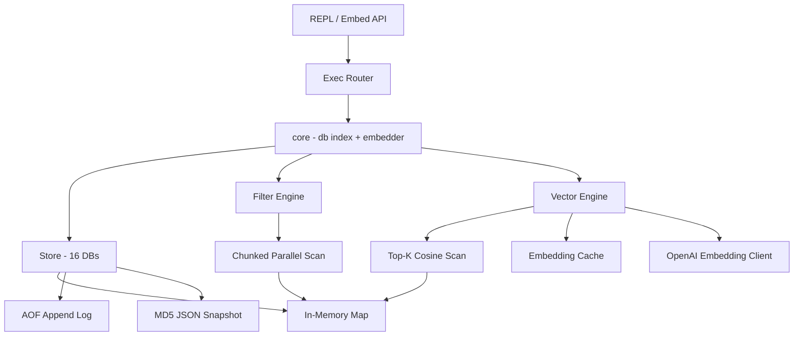

> [!NOTE]
> This README was generated by [SKILL](https://github.com/pardnchiu/skill-readme-generate), get the ZH version from [here](./doc/README.zh.md).

***

<p align="center">
  <strong>EMBEDDED KV WITH JSON QUERY AND SEMANTIC VECTOR SEARCH!</strong>
</p>

<p align="center">
<a href="https://pkg.go.dev/github.com/agenvoy/toriidb"></a>
<a href="LICENSE"></a>
<a href="https://github.com/agenvoy/toriidb/releases"></a>
</p>

***

> A Go embedded KV database with dot-notation JSON queries, inline vector embeddings, cosine top-K search, and AOF persistence

## Table of Contents

- [Use Cases](#use-cases)
- [Features](#features)
- [Architecture](#architecture)
- [File Structure](#file-structure)
- [Version History](#version-history)
- [License](#license)
- [Author](#author)
- [Stars](#stars)

## Use Cases

ToriiDB is a **four-in-one embedded database** — a single Go binary providing:

- **KV cache** — Redis-style commands and data model
- **Document DB** — MongoDB-style JSON field queries and infix expressions
- **Vector DB** — OpenAI embeddings inlined on each key, cosine top-K semantic retrieval
- **Local persistence** — AOF append log + JSON snapshots, with an in-memory parsed cache

No extra service, no secondary index engine, no separate vector store; embeddings live inline on each key and flow through the same AOF and compaction paths as the KV values. Aimed at Go projects that want to replace a Redis + MongoDB + Pinecone stack with a single import, not run one behind a network.

Best suited for single-process, single-host embedded scenarios with up to ~10k entries per database:

- CLI tools — local config and state storage
- Prototypes / MVPs — skip the DB setup and embed directly
- Desktop apps and IoT devices — embedded storage, cross-compile friendly
- LINE bots and Discord bots — conversation state and user data
- AI personal assistants — memory, chat history, preferences, context cache, semantic recall
- Small-scale RAG and semantic search — documents, FAQs, notes with inline embeddings
- Single-host API servers — sessions, tokens, config, and other lightweight storage
- Personal blogs and small CMS backends — up to a few thousand posts or users
- Small-to-mid projects that don't warrant Redis / MongoDB / SQLite / a dedicated vector DB

**Not suitable for**: high-concurrency online services, datasets larger than memory, cross-machine access, multi-process writers, heavy queries that require index acceleration, or vector corpora beyond ~10k entries where linear scan becomes a bottleneck.

A MongoDB export utility is planned; the data model maps across natively.

## Features

> `go get github.com/agenvoy/toriidb` · [Documentation](./doc/doc.md)

### Redis × Mongo × Vector Hybrid DX

Redis-style KV commands, MongoDB-style field predicates, and semantic vector search behind a single command surface — cache, document lookup, and similarity retrieval in one API.

### Inline Per-Key Vector Embeddings

`SET ... VECTOR` attaches an OpenAI embedding directly to the key — no separate index, no sidecar store; the vector rides alongside the value through AOF and compaction.

### Content-Addressed Embedding Cache

Embeddings are cached under `__torii:embed:<sha256(model|dim|text)>` and transparently reused — identical texts never hit the OpenAI API twice, even across restarts.

### Top-K Cosine Search

`VSEARCH` runs a linear scan with a min-heap, filters by glob `MATCH`, honours `LIMIT`, skips expired and dimension-mismatched entries, and reuses the cached query embedding.

### 16 Databases with Lazy Replay

Redis-compatible DB 0-15 namespaces, each with its own memory and AOF; replay only happens on first access, keeping startup free.

### Dual Persistence

AOF appends every write in order while each key also lands as a JSON snapshot under an MD5 three-level directory for external tooling.

### In-Place JSON Field Ops

`GET` / `SET` / `DEL` / `INCR` operate on nested fields via dot-notation without read-modify-write round trips.

### Infix Query Expression

`QUERY` supports AND / OR / NOT with parentheses, exposed both as composable structs and as string expressions for untrusted input.

### Auto-Chunked Parallel Scan

`FIND` / `QUERY` shards scans past 1024 entries across goroutines; complex predicates over 10k entries benchmark at ~3ms on Apple M5.

### Split-Lock Parsed Cache

JSON writes warm a parsed cache; reads take only an RLock and hit the cache, eliminating repeated `json.Unmarshal` on hot paths.

### Independent Sessions

A single Store spawns Sessions that carry their own db index so concurrent goroutines can switch databases without interfering.

### Size-Triggered Compaction

AOF auto-compacts inline when it doubles its baseline; `Close()` drains pending async embeds via `sync.WaitGroup` then compacts all active DBs in parallel.

### Reserved Internal Namespace

Scan commands (`KEYS` / `FIND` / `QUERY` / `VSEARCH`) skip the `__torii:*` prefix so internal keys like the embedding cache never leak to users.

### Automatic Type Detection

Values are classified as JSON / String / Int / Float / Bool / Date on write and queryable via `TYPE`.

## Architecture

> [Full Architecture](./doc/architecture.md)



## File Structure

```
ToriiDB/
├── cmd/
│   └── test/
│       └── main.go              # REPL entry point
├── core/
│   ├── openai/                  # text-embedding-3-small client (singleton)
│   ├── store/                   # storage engine and command impls
│   │   ├── vector.go            # float32 codec + cosine + isInternal
│   │   ├── vcache.go            # __torii:embed:* cache
│   │   ├── vsearch.go           # top-K min-heap cosine scan
│   │   ├── vsim.go              # VSim + VGet
│   │   └── filter/              # query expression and operators
│   └── utils/                   # shared helpers
├── .env                         # OPENAI_API_KEY (optional, for vector features)
├── go.mod
├── Makefile
└── README.md
```

## Version History

| Version | Date | Highlights |
|---------|------|------------|
| v0.5.0 | 2026-04-18 | Semantic vector search — `SET ... VECTOR` inline embeddings, `VSEARCH` top-K cosine, `VSIM` / `VGET`, content-hash embedding cache under `__torii:embed:*`, AOF vector persistence |
| v0.4.4 | 2026-04-16 | Parsed JSON cache in `Entry` to eliminate repeated `Unmarshal` on hot paths; split-lock read/write APIs |
| v0.4.3 | 2026-04-10 | AOF compaction switched from line count to byte size with 1MB floor |
| v0.4.2 | 2026-04-10 | Inline AOF compaction triggered when inflation ratio exceeds 2x |
| v0.4.1 | 2026-04-10 | Shared `core` struct enabling `Session`, lazy DB replay, parallel compaction, custom storage path |
| v0.4.0 | 2026-04-09 | NE operator, dedicated `filter` package with infix expression parser (AND/OR/NOT), concurrent slice scan |
| v0.3.0 | 2026-04-08 | FIND / QUERY commands with EQ/GT/GE/LT/LE/LIKE operators, LIMIT clause, time-based sorting |
| v0.2.0 | 2026-04-08 | Document field ops (GetField/SetField/DelField), KEYS glob matching, INCR with dot-notation nested fields |
| v0.1.0 | 2026-04-08 | Initial release — REPL, KV commands (SET/GET/DEL/EXIST/TYPE), AOF persistence, TTL, 16 databases (DB 0-15) |

## License

This project is licensed under the [MIT LICENSE](LICENSE).

## Author


<h4 style="padding-top: 0">邱敬幃 Pardn Chiu</h4>

<a href="mailto:dev@pardn.io" target="_blank">

</a> <a href="https://linkedin.com/in/pardnchiu" target="_blank">

</a>

## Stars

[](https://www.star-history.com/#agenvoy/toriidb&Date)

***

©️ 2026 [邱敬幃 Pardn Chiu](https://linkedin.com/in/pardnchiu)
