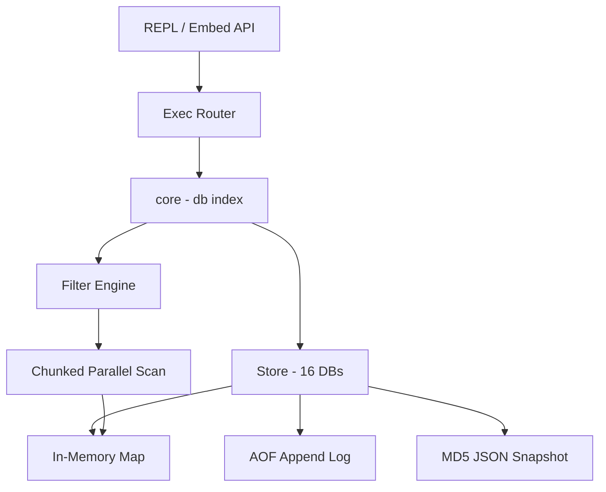

> [!NOTE]
> This README was generated by [SKILL](https://github.com/pardnchiu/skill-readme-generate), get the ZH version from [here](./doc/README.zh.md).

***

<p align="center">
  <strong>EMBEDDED KV WITH JSON DOCUMENT QUERY, ZERO DEPENDENCIES!</strong>
</p>

<p align="center">
<a href="https://pkg.go.dev/github.com/pardnchiu/ToriiDB"></a>
<a href="LICENSE"></a>
<a href="https://github.com/pardnchiu/ToriiDB/releases"></a>
</p>

***

> A Go embedded KV database with dot-notation JSON queries, AOF persistence, and Redis-style commands

## Table of Contents

- [Use Cases](#use-cases)
- [Features](#features)
- [Architecture](#architecture)
- [File Structure](#file-structure)
- [License](#license)
- [Author](#author)
- [Stars](#stars)

## Use Cases

At its core this is KV storage — lookups run as full scans with per-value type inference rather than through a traditional query engine. Data is persisted to disk (AOF + JSON snapshots) with an in-memory cache for reads. There are no indexes: `GET` / `SET` are O(1), `FIND` / `QUERY` are O(n); scans over 1024 entries auto-shard across goroutines, and complex predicates over 10k entries benchmark at ~3ms on Apple M5.

Best suited for single-process, single-host embedded scenarios with up to ~10k entries per database:

- CLI tools — local config and state storage
- Prototypes / MVPs — skip the DB setup and embed directly
- Desktop apps and IoT devices — embedded storage, cross-compile friendly
- LINE bots and Discord bots — conversation state and user data
- AI personal assistants — memory, chat history, preferences, context cache
- Single-host API servers — sessions, tokens, config, and other lightweight storage
- Personal blogs and small CMS backends — up to a few thousand posts or users
- Small-to-mid projects that don't warrant Redis / MongoDB / SQLite

**Not suitable for**: high-concurrency online services, datasets larger than memory, cross-machine access, multi-process writers, or heavy queries that require index acceleration.

A MongoDB export utility is planned; the data model maps across natively.

## Features

> `go get github.com/pardnchiu/ToriiDB` · [Documentation](./doc/doc.md)

### Zero Dependencies

Pure Go standard library only — no cgo, no third-party packages, cross-compile and embed anywhere.

### Redis × Mongo Hybrid DX

Redis-style KV commands paired with MongoDB-style field predicates, covering both cache and document lookup in one API.

### 16 Databases with Lazy Replay

Redis-compatible DB 0-15 namespaces, each with its own memory and AOF; replay only happens on first access, keeping startup free.

### Dual Persistence

AOF appends every write in order while each key also lands as a JSON snapshot under an MD5 three-level directory for external tooling.

### In-Place JSON Field Ops

`GET` / `SET` / `DEL` / `INCR` operate on nested fields via dot-notation without read-modify-write round trips.

### Infix Query Expression

`QUERY` supports AND / OR / NOT with parentheses, exposed both as composable structs and as string expressions for untrusted input.

### Auto-Chunked Parallel Scan

`FIND` / `QUERY` shards scans past 1024 entries across goroutines; complex predicates over 10k entries benchmark at ~3ms on Apple M5.

### Split-Lock Parsed Cache

JSON writes warm a parsed cache; reads take only an RLock and hit the cache, eliminating repeated `json.Unmarshal` on hot paths.

### Independent Sessions

A single Store spawns Sessions that carry their own db index so concurrent goroutines can switch databases without interfering.

### Size-Triggered Compaction

AOF auto-compacts inline when it doubles its baseline; `Close()` compacts all active DBs in parallel, so shutdown is bounded by the slowest one.

### Automatic Type Detection

Values are classified as JSON / String / Int / Float / Bool / Date on write and queryable via `TYPE`.

## Architecture

> [Full Architecture](./doc/architecture.md)



## File Structure

```
ToriiDB/
├── cmd/
│   └── test/
│       └── main.go              # REPL entry point
├── core/
│   ├── store/                   # storage engine and command impls
│   │   └── filter/              # query expression and operators
│   └── utils/                   # shared helpers
├── go.mod
├── Makefile
└── README.md
```

## License

This project is licensed under the [MIT LICENSE](LICENSE).

## Author


<h4 style="padding-top: 0">邱敬幃 Pardn Chiu</h4>

<a href="mailto:dev@pardn.io" target="_blank">

</a> <a href="https://linkedin.com/in/pardnchiu" target="_blank">

</a>

## Stars

[](https://www.star-history.com/#pardnchiu/ToriiDB&Date)

***

©️ 2026 [邱敬幃 Pardn Chiu](https://linkedin.com/in/pardnchiu)
