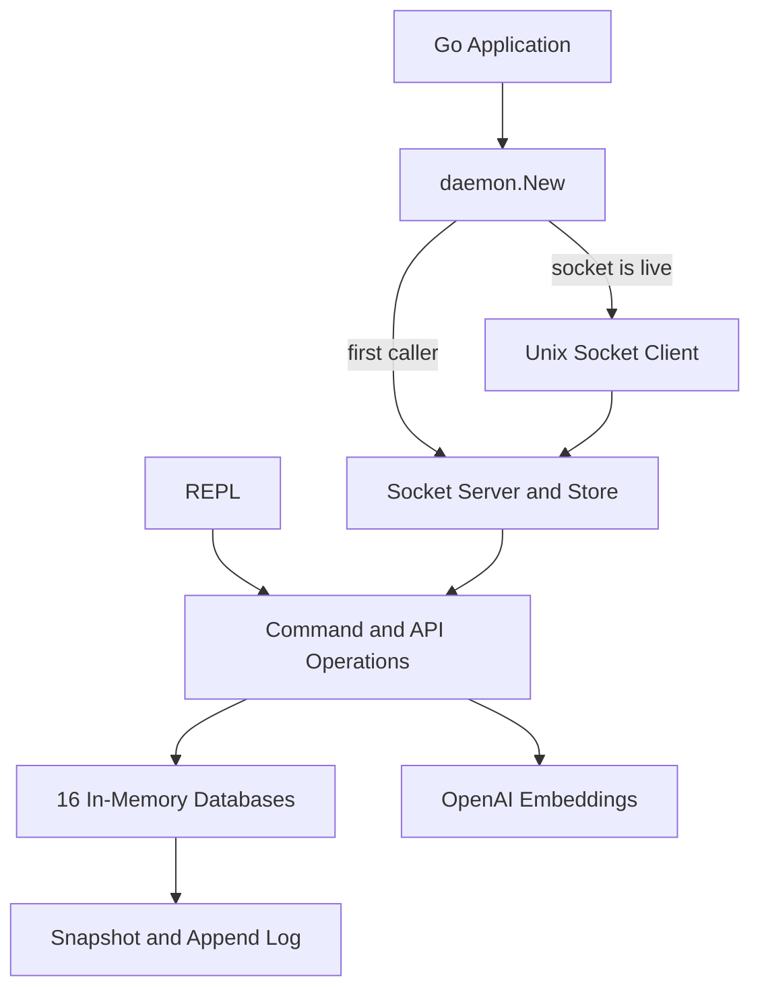

Last updated: 2026-10-06

> [!NOTE]
> This README was generated by [SKILL](https://github.com/agenvoy/skill-readme-generate), get the ZH version from [here](./doc/README.zh.md).

***

<strong>EMBEDDED JSON KV STORAGE WITH A SHARED SOCKET DAEMON AND VECTOR SEARCH</strong>

***

> A Go embedded key-value database with Redis-style commands, a shared socket daemon, and vector search

## Table of Contents

- [Features](#features)
- [Architecture](#architecture)
- [License](#license)
- [Author](#author)

## Features

> `go get github.com/pardnchiu/toriidb` · [Documentation](./doc/doc.md)

- **One Daemon Per Directory** — The first process to call `daemon.New` on a data directory serves a unix socket, and every later caller becomes a client using the same Get/Set/Del methods.
- **Crash-Safe Snapshot Persistence** — Every write is fsynced to an append log, and compaction atomically swaps in a new snapshot while keeping the previous generation for fallback replay.
- **JSON Field Mutation** — Read, set, increment, and delete nested fields with dot notation, and filter documents with AND/OR/NOT query expressions.
- **Built-In Vector Search** — Attach OpenAI embeddings in the background, reuse cached vectors, and rank keys by cosine similarity with glob filters.
- **Redis-Style Command Router** — Run 17 commands across 16 isolated databases with TTL expiry, from the REPL or the Go API.

## Architecture

> [Full Architecture](./doc/architecture.md)

```mermaid
graph TB
    APP[Go Application] --> NEW[daemon.New]
    NEW -->|socket is live| CLI[Unix Socket Client]
    NEW -->|first caller| SRV[Socket Server and Store]
    CLI --> SRV
    REPL[REPL] --> OPS[Command and API Operations]
    SRV --> OPS
    OPS --> DBS[16 In-Memory Databases]
    DBS --> DISK[Snapshot and Append Log]
    OPS --> EMB[OpenAI Embeddings]
```

## License

This project is licensed under the [MIT LICENSE](LICENSE).

## Author

Just [open an issue](https://github.com/pardnchiu/toriidb/issues/new) to share an idea.

***

©️ 2026 [邱敬幃 Pardn Chiu](https://www.linkedin.com/in/pardnchiu)
