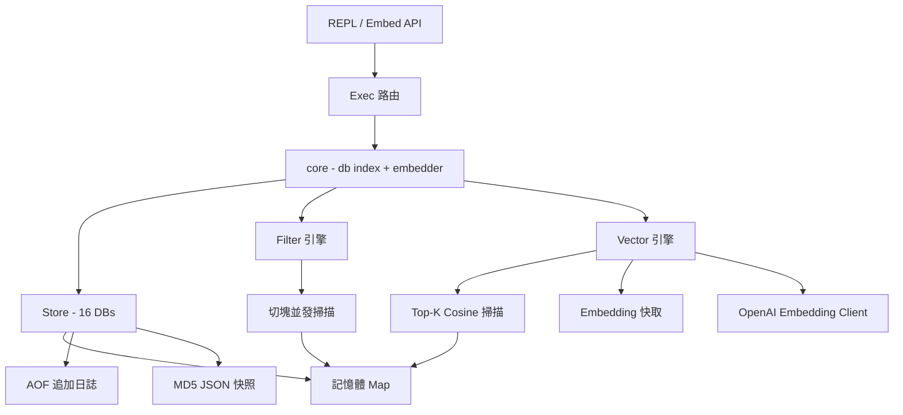

> [!NOTE]
> 此 README 由 [SKILL](https://github.com/pardnchiu/skill-readme-generate) 生成，英文版請參閱 [這裡](../README.md)。

***

<p align="center">
  <strong>EMBEDDED KV WITH JSON QUERY AND SEMANTIC VECTOR SEARCH!</strong>
</p>

<p align="center">
<a href="https://pkg.go.dev/github.com/pardnchiu/ToriiDB"></a>
<a href="LICENSE"></a>
<a href="https://github.com/pardnchiu/ToriiDB/releases"></a>
</p>

***

> Go 嵌入式 KV 資料庫，具備 dot-notation JSON 查詢、每筆內嵌向量、cosine top-K 搜尋與 AOF 持久化

## 目錄

- [適用場景](#適用場景)
- [功能特點](#功能特點)
- [架構](#架構)
- [檔案結構](#檔案結構)
- [版本歷程](#版本歷程)
- [授權](#授權)
- [Author](#author)
- [Stars](#stars)

## 適用場景

專案定位為**四合一嵌入式資料庫**，單一 Go 執行檔同時具備：

- **KV 快取** — Redis 風格命令與資料模型
- **文件資料庫** — MongoDB 風格 JSON 欄位查詢與中綴表達式
- **向量資料庫** — OpenAI embedding 內嵌於 key，支援 cosine top-K 語意檢索
- **本地持久化** — AOF 追加日誌 + JSON 快照，記憶體快取加速讀取

不需要另起服務、不需要額外索引引擎、也不需要獨立的向量儲存；向量直接內嵌在每個 key 上，與 KV 值一同經過 AOF 與壓縮流程。適合 Go 專案以單一 import 取代 Redis + MongoDB + Pinecone 這種輕量組合。

適合資料量在萬筆以內、單機單進程的嵌入式場景：

- CLI 工具 — 本地設定與狀態儲存
- Prototype / MVP — 省去架設 DB 的時間，直接嵌入
- 桌面應用、IoT 裝置 — 嵌入式儲存，交叉編譯友善
- Line Bot、Discord Bot — 對話狀態與用戶資料
- AI 個人助理 — 記憶儲存、對話歷史、偏好設定、上下文快取、語意記憶召回
- 小規模 RAG 與語意搜尋 — 文件、FAQ、筆記內嵌 embedding 直接搜尋
- 單機 API Server — Session、Token、設定檔等輕量儲存
- 個人部落格、CMS 後台 — 千篇文章、萬名用戶以內
- 量級用不到 Redis / MongoDB / SQLite / 專用向量 DB 的中小型專案

**不適合**：高併發線上服務、資料量超過記憶體、跨機器存取、多進程同時寫入、需要索引加速的大量查詢，或向量資料量遠超萬筆以致線性掃描成為瓶頸的場景。

後續將提供匯出至 MongoDB 的工具函式，資料結構天然相容。

## 功能特點

> `go get github.com/pardnchiu/ToriiDB` · [完整文件](./doc.zh.md)

### Redis × Mongo × Vector 混合 DX

Redis 風格的 KV 命令、MongoDB 風格的欄位條件、語意向量搜尋，單一命令介面同時覆蓋快取、文件查找與相似度檢索。

### 每筆 Key 內嵌向量

`SET ... VECTOR` 直接把 OpenAI embedding 掛在對應 key 上 — 無獨立索引、無旁路儲存；向量與值一同經過 AOF 與壓縮流程。

### 內容雜湊 Embedding 快取

Embedding 以 `__torii:embed:<sha256(model|dim|text)>` 快取並自動重用 — 相同文字永不重複打 OpenAI API，跨重啟也有效。

### Top-K Cosine 搜尋

`VSEARCH` 以線性掃描 + min-heap 實作，支援 glob `MATCH`、`LIMIT`，自動跳過過期與維度不符的 entry，查詢向量也走快取。

### 16 獨立資料庫 + Lazy Replay

與 Redis 一致的 DB 0-15 命名空間，各自擁有獨立記憶體與 AOF，首次存取才掃描 AOF，啟動零成本。

### 雙重持久化

AOF 連續追加保證寫入順序，每個 key 同時寫入 MD5 三層目錄下的單檔 JSON 快照，方便外部工具直接讀取。

### JSON 欄位就地操作

`GET` / `SET` / `DEL` / `INCR` 直接以 dot-notation 操作巢狀欄位，不需先取出整份文件再回寫。

### 中綴查詢表達式

`QUERY` 支援 AND / OR / NOT 與括號分組，可選結構體組合或字串表達式兩種風格，後者適合接受外部輸入。

### 自動切塊並發掃描

`FIND` / `QUERY` 掃描超過 1024 筆自動切塊並發處理，萬筆級複合查詢 Apple M5 實測 ~3ms。

### 解析快取讀寫分離

JSON 寫入時同步快取已解析物件，查詢路徑走 RLock 讀快取直接命中，完全省去重複 `json.Unmarshal`。

### 獨立 Session

同一 Store 可衍生擁有獨立 db index 的 Session，讓併發 goroutine 各自切換資料庫不互相干擾。

### AOF 膨脹觸發壓縮

AOF 大小達基準 2× 時 inline compact，`Close()` 會先 `sync.WaitGroup` 等待背景 embed 排空再並行壓縮所有活躍 DB。

### 保留內部命名空間

掃描類指令（`KEYS` / `FIND` / `QUERY` / `VSEARCH`）自動跳過 `__torii:*` 前綴，embedding 快取等內部 key 不會外露。

### 型別自動偵測

寫入時自動判定 JSON / String / Int / Float / Bool / Date，`TYPE` 指令可直接查詢。

## 架構

> [完整架構](./architecture.zh.md)



## 檔案結構

```
ToriiDB/
├── cmd/
│   └── test/
│       └── main.go              # REPL 進入點
├── core/
│   ├── openai/                  # text-embedding-3-small client（singleton）
│   ├── store/                   # 儲存引擎與命令實作
│   │   ├── vector.go            # float32 編解碼 + cosine + isInternal
│   │   ├── vcache.go            # __torii:embed:* 快取
│   │   ├── vsearch.go           # top-K min-heap cosine 掃描
│   │   ├── vsim.go              # VSim + VGet
│   │   └── filter/              # 查詢表達式與運算子
│   └── utils/                   # 共用工具函式
├── .env                         # OPENAI_API_KEY（向量功能選用）
├── go.mod
├── Makefile
└── README.md
```

## 版本歷程

| 版本 | 日期 | 重點 |
|------|------|------|
| v0.5.0 | 2026-04-18 | 語意向量搜尋 — `SET ... VECTOR` 內嵌 embedding、`VSEARCH` top-K cosine、`VSIM` / `VGET`、`__torii:embed:*` 內容雜湊快取、AOF 向量持久化 |
| v0.4.4 | 2026-04-16 | `Entry` 加入 parsed JSON 快取，消除熱路徑重複 `Unmarshal`；讀寫 API 拆分（split-lock） |
| v0.4.3 | 2026-04-10 | AOF compaction 觸發條件由行數改為 byte size，下限 1MB |
| v0.4.2 | 2026-04-10 | AOF 膨脹率達 2x 時觸發 inline compaction |
| v0.4.1 | 2026-04-10 | 抽離 `core` struct 支援 `Session`、lazy DB replay、平行 compaction、自訂儲存路徑 |
| v0.4.0 | 2026-04-09 | 新增 NE 運算子，抽離 `filter` 套件並提供 infix 表達式解析（AND/OR/NOT）、並發切塊掃描 |
| v0.3.0 | 2026-04-08 | FIND / QUERY 指令，支援 EQ/GT/GE/LT/LE/LIKE、LIMIT 與時間排序 |
| v0.2.0 | 2026-04-08 | Document 欄位操作（GetField/SetField/DelField）、KEYS glob 匹配、INCR 支援 dot-notation 巢狀欄位 |
| v0.1.0 | 2026-04-08 | 初始版本 — REPL、KV 指令（SET/GET/DEL/EXIST/TYPE）、AOF 持久化、TTL、16 資料庫（DB 0-15） |

## 授權

本專案採用 [MIT LICENSE](../LICENSE)。

## Author


<h4 style="padding-top: 0">邱敬幃 Pardn Chiu</h4>

<a href="mailto:dev@pardn.io" target="_blank">

</a> <a href="https://linkedin.com/in/pardnchiu" target="_blank">

</a>

## Stars

[](https://www.star-history.com/#pardnchiu/ToriiDB&Date)

***

©️ 2026 [邱敬幃 Pardn Chiu](https://linkedin.com/in/pardnchiu)
