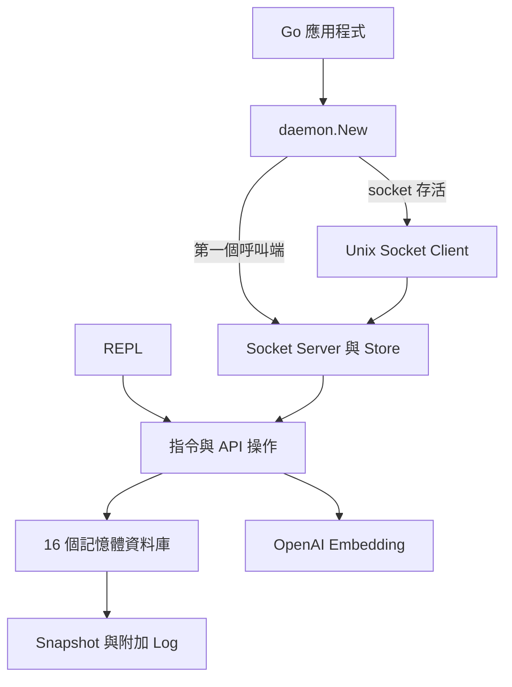

最後更新：2026-10-06

> [!NOTE]
> 此 README 由 [SKILL](https://github.com/agenvoy/skill-readme-generate) 生成，英文版請參閱 [這裡](../README.md)。

***

<strong>EMBEDDED JSON KV STORAGE WITH A SHARED SOCKET DAEMON AND VECTOR SEARCH</strong>

***

> Go 內嵌式鍵值資料庫，具備 Redis 風格指令、共用 socket daemon 與向量搜尋

## 目錄

- [功能特點](#功能特點)
- [架構](#架構)
- [授權](#授權)
- [Author](#author)

## 功能特點

> `go get github.com/pardnchiu/toriidb` · [完整文件](./doc.zh.md)

- **一個目錄一個 Daemon** — 第一個對資料目錄呼叫 `daemon.New` 的 process 提供 unix socket，其後的呼叫端自動成為 client，並使用同一組 Get／Set／Del 方法。
- **當機安全的 Snapshot 持久化** — 每筆寫入都 fsync 到附加 log，壓縮時以原子方式換上新 snapshot，並保留前一世代供重播退回。
- **JSON 欄位增修** — 以點記法讀取、設定、遞增與刪除巢狀欄位，並用 AND／OR／NOT 運算式篩選文件。
- **內建向量搜尋** — 在背景附加 OpenAI embedding、重用快取向量，並依餘弦相似度搭配 glob 篩選排序鍵。
- **Redis 風格指令路由** — 17 個指令橫跨 16 個隔離資料庫並支援 TTL 過期，可從 REPL 或 Go API 使用。

## 架構

> [完整架構](./architecture.zh.md)

```mermaid
graph TB
    APP[Go 應用程式] --> NEW[daemon.New]
    NEW -->|socket 存活| CLI[Unix Socket Client]
    NEW -->|第一個呼叫端| SRV[Socket Server 與 Store]
    CLI --> SRV
    REPL[REPL] --> OPS[指令與 API 操作]
    SRV --> OPS
    OPS --> DBS[16 個記憶體資料庫]
    DBS --> DISK[Snapshot 與附加 Log]
    OPS --> EMB[OpenAI Embedding]
```

## 授權

本專案採用 [MIT LICENSE](../LICENSE)。

## Author

Just [open an issue](https://github.com/pardnchiu/toriidb/issues/new) to share an idea.

***

©️ 2026 [邱敬幃 Pardn Chiu](https://www.linkedin.com/in/pardnchiu)
