# ToriiDB - Architecture

> Back to [README](../README.md)

## Overview

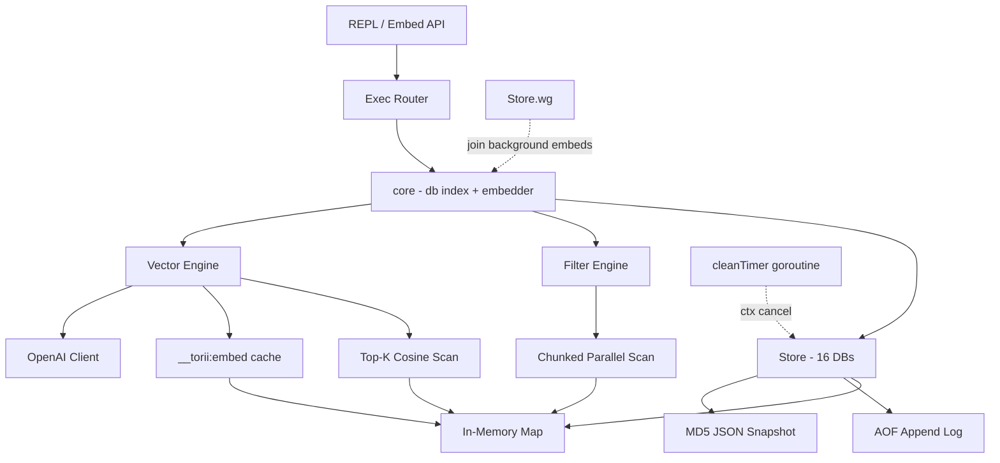

Core object relationships:

- `Store` owns the `[16]*db` array, the `cleanTimer` context cancel, and the `sync.WaitGroup` that tracks in-flight async vector attaches.
- `core` is the struct embedded by both `Store` and `Session`, holding a pointer to `Store.allDBs`, the current db index, and the shared `*openai.Client` (nil if `OPENAI_API_KEY` is not set).
- `Session` is spawned by `Store.Session()`, sharing the underlying db array, embedder, and WaitGroup while owning its own index.
- The `filter` package is independent from `store`, consumed only through the `Filter` interface in `Query`.
- The vector path is opt-in: `SetVector` / `VSearch` no-op with an explicit error when the embedder is nil, so the core KV path stays dependency-free at runtime.

## Module: Store

Owns the database lifecycle, directory layout, and background expiration sweeper.

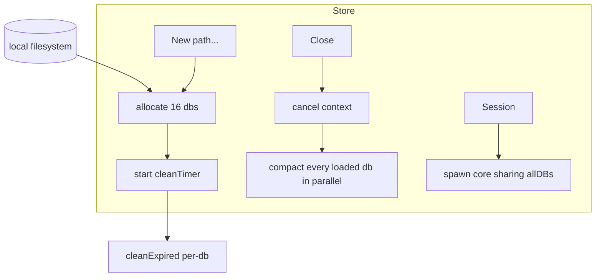

- `New(path ...string)`: validates the directory, allocates `[16]*db`, and starts the background goroutine that runs `cleanExpired` every minute.
- `Close()`: cancels the context so `cleanTimer` exits, then uses a `sync.WaitGroup` to compact every `loaded` db in parallel.
- `Session()`: clones `core` so upper-layer goroutines can switch databases without affecting the original Store.

## Module: db

Per-database memory state and persistence carriers.

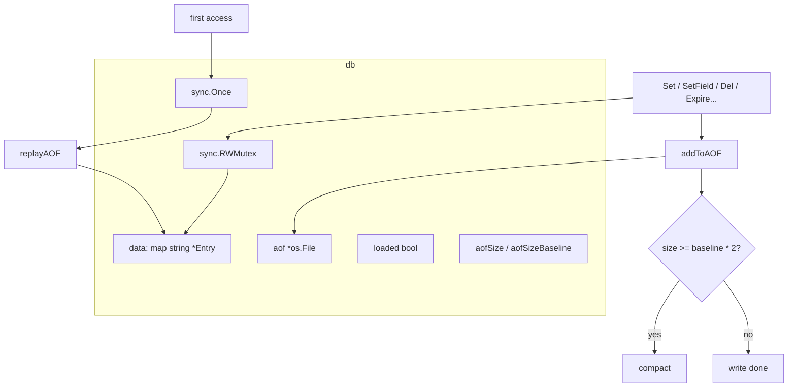

- `ensureLoaded`: `sync.Once` guarantees AOF replay only runs once, so pre-access startup cost is zero.
- `init`: lazily creates the AOF file, opening `record.aof` only on the first write.
- `compact`: closes the current AOF, remarshals non-expired entries, and atomically replaces the file via `utils.WriteFile`.
- `cleanExpired`: scans `data`, drops entries whose `ExpireAt <= now`, and removes their JSON snapshot files.

## Module: Entry

Represents both in-memory state and the on-disk JSON snapshot format, while maintaining a parsed cache.

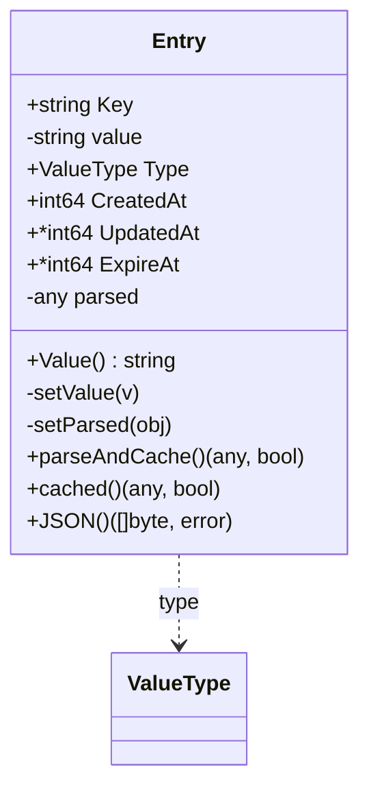

Lock discipline:

- `parseAndCache()` mutates `e.parsed`, so callers must hold the write lock or run single-threaded (`Set` / `SetField` / `IncrField` / `DelField` / AOF replay).
- `cached()` only reads `e.parsed` and is safe to call under an RLock (`Query` / `GetField`).
- Every write path must warm `parsed` before releasing the write lock so readers always see a populated cache.

## Module: Exec

The single routing point for REPL commands, parsing string input into `core` method calls.

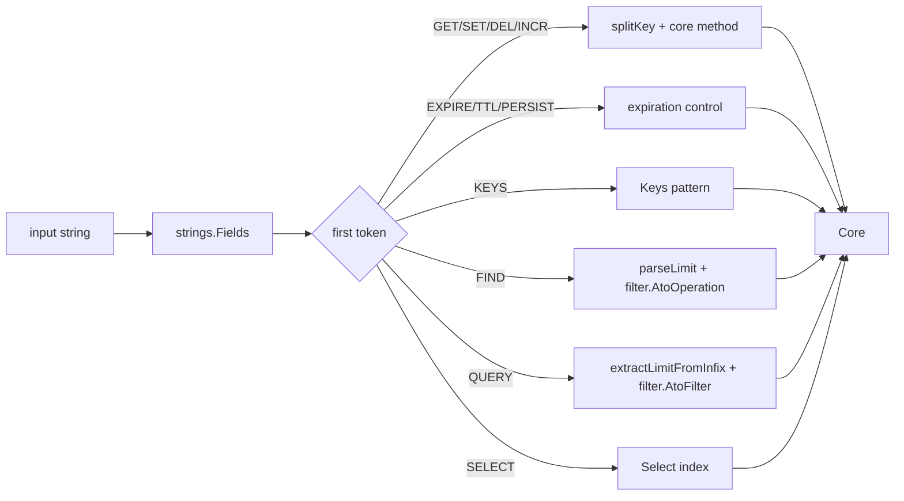

- `splitKey` cuts on the first `.` into main key + sub-keys; without a `.`, the plain KV path runs.
- `parseSetArgs` walks the args backwards: a trailing integer is treated as TTL seconds, and a preceding `NX`/`XX` becomes the flag.
- `extractLimitFromInfix` and `parseLimit` strip `LIMIT <n>` from the tail of the expression.

## Module: filter

The shared predicate engine under `Query`, also shipping a string-expression parser.

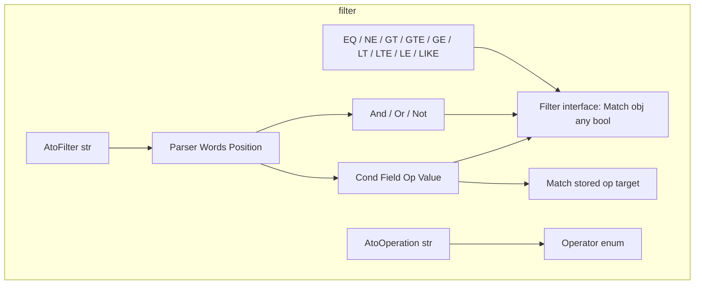

- `Parser` is recursive-descent: `Or` → `And` → `Not` → `Primary`, with parentheses and base predicates handled inside `Primary`.
- `AtoFilter` first peels leading `(` and trailing `)` into standalone tokens, then hands the token list to `Parser.Or()` to build the AST.
- `Match` accepts both numeric and string values — numeric comparison first tries `utils.Vtof`, falling back to string comparison on failure.

## Module: Vector

Vector persistence lives inline on each `Entry`; the only sidecar is the embedding cache under the `__torii:embed:*` prefix.

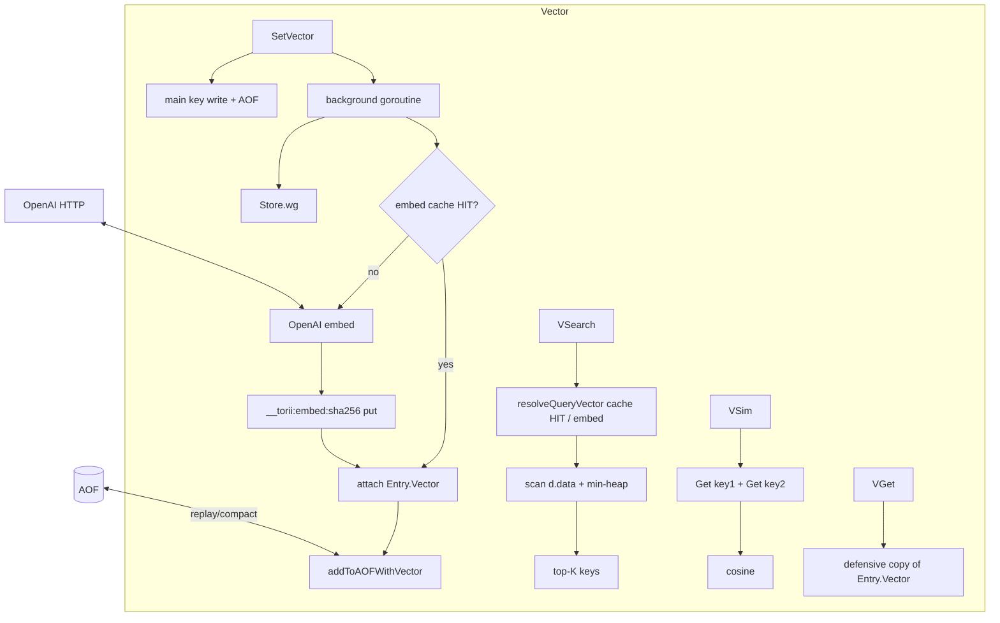

- `Entry.Vector []float32`: inline per-key embedding, `nil` when absent.
- `vector.go`: base64 little-endian float32 codec (`encodeVector` / `decodeVector`), `cosine`, and `isInternal` — any key with the reserved `__torii:` prefix is skipped by scan commands.
- `vcache.go`: `getVector` / `putVector` store cached embeddings under `__torii:embed:<sha256(model|dim|text)>`. Payload is JSON `{"v":"<base64>","d":<dim>,"m":"<model>"}`. `d != currentDim` is treated as MISS; no TTL since embeddings are deterministic per (model, dim, text).
- `aof.go`: `AOFRecord.Vector *string` persists the base64 vector; emitted only when `len(vec) > 0` for backward compatibility. `replayAOF` decodes back into `Entry.Vector`; `compact` re-emits.
- `SetVector` lock order: main key write under write lock → AOF → release; background goroutine reads `__torii:embed:*` under RLock, calls OpenAI under **no lock**, then takes the write lock twice (once to put cache, once to attach to main key + append AOF).
- Plain `Set()` invalidates `Entry.Vector` on overwrite — a re-set without `VECTOR` means the underlying text changed, so the stale embedding is dropped.
- `VSearch` holds the db RLock across the whole scan; `scanTopK` maintains a size-k min-heap so worst case is O(n log k).
- `Close()` blocks on `Store.wg` before compacting AOF, guaranteeing no in-flight embed races the shutdown.

## Data Flow: Set → Persistence

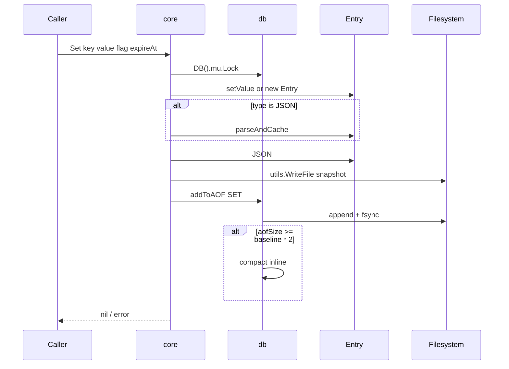

## Data Flow: Query → Chunked Parallelism

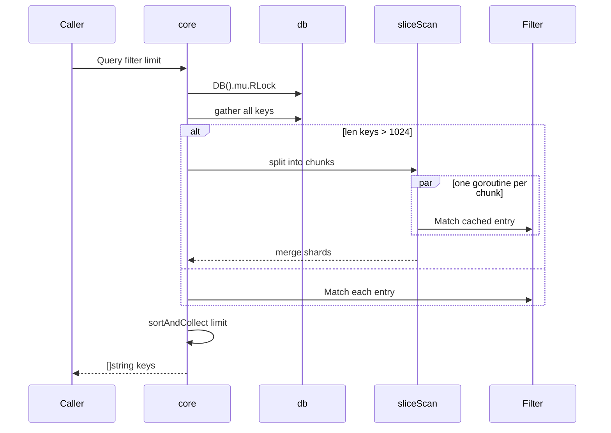

## Data Flow: SetVector → async attach

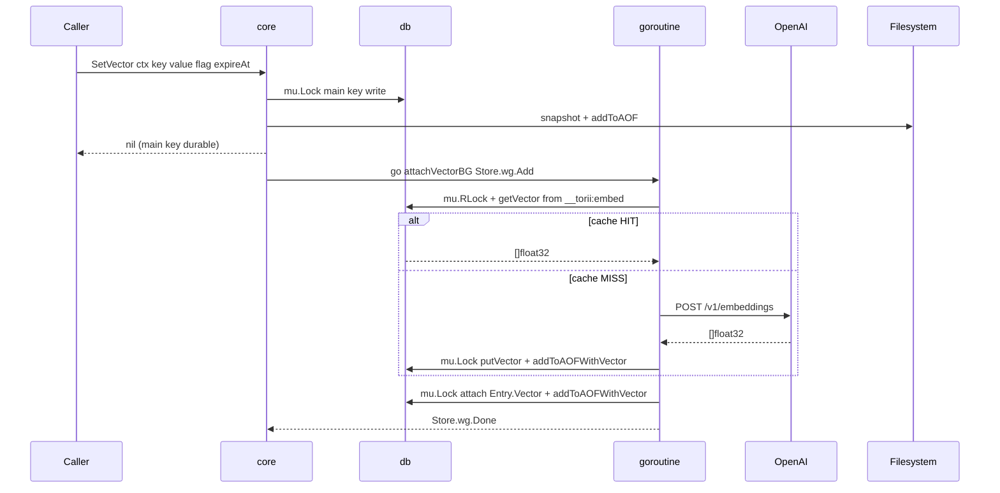

## Data Flow: VSearch → top-K cosine

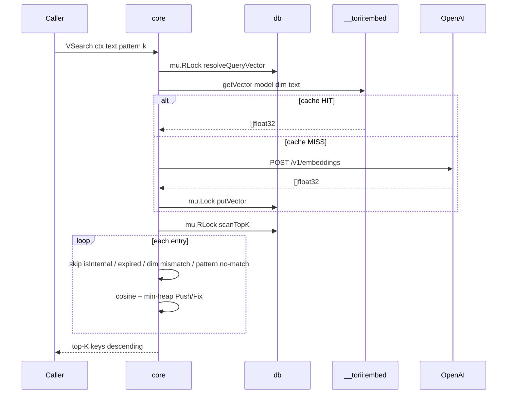

## State Machine: db lifecycle

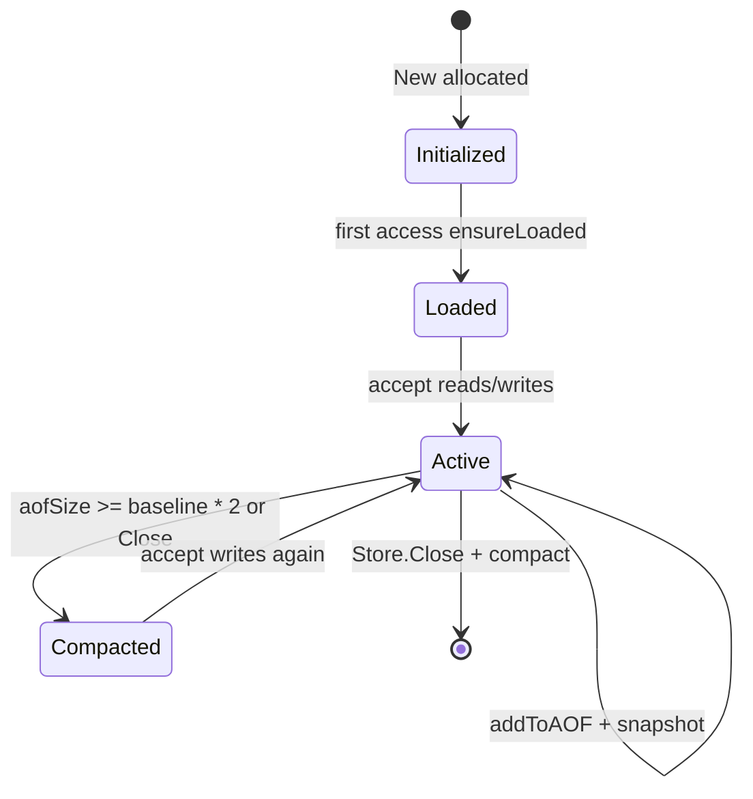

***

©️ 2026 [邱敬幃 Pardn Chiu](https://linkedin.com/in/pardnchiu)
