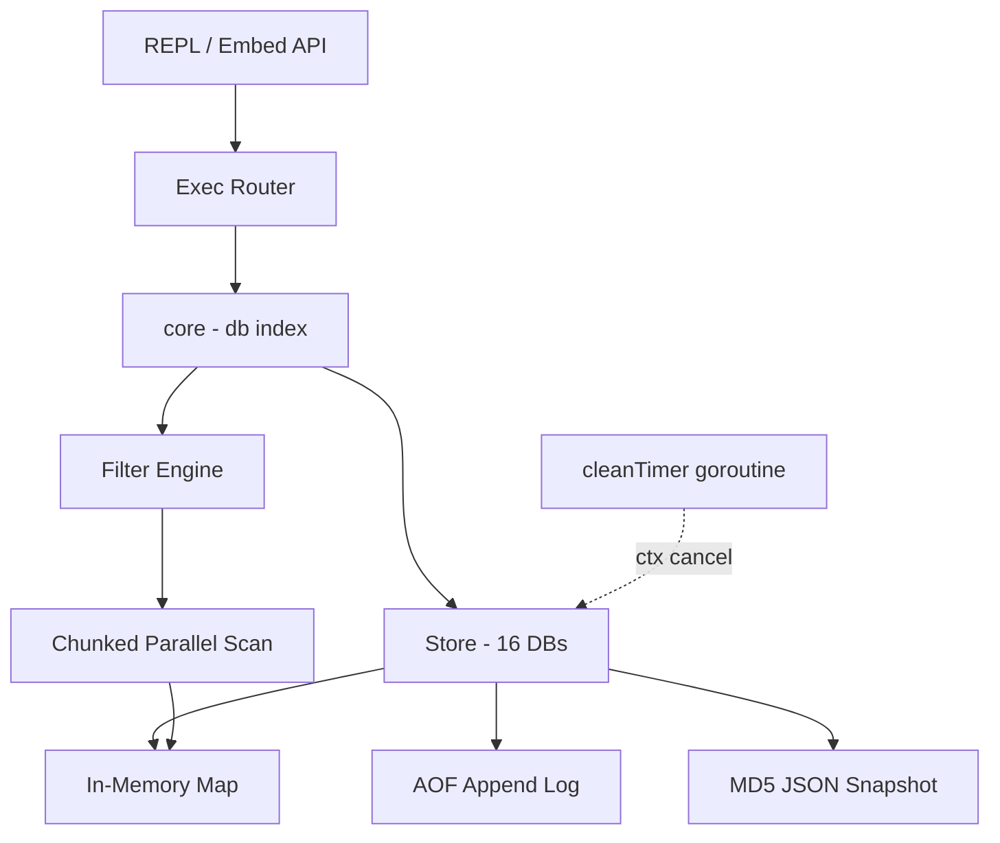
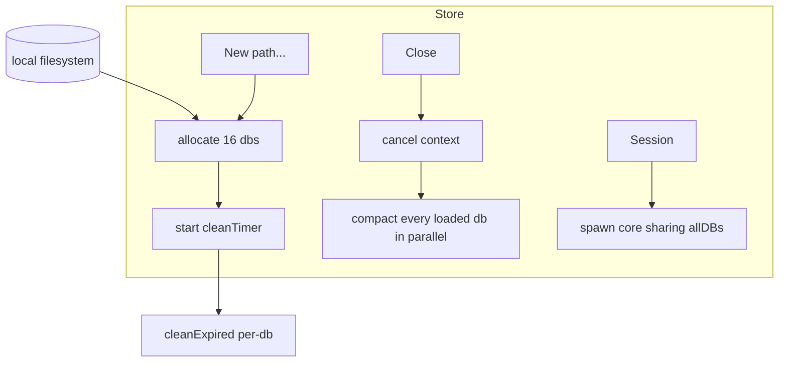
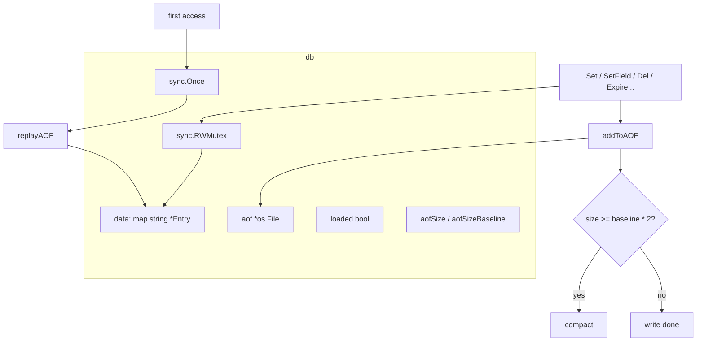
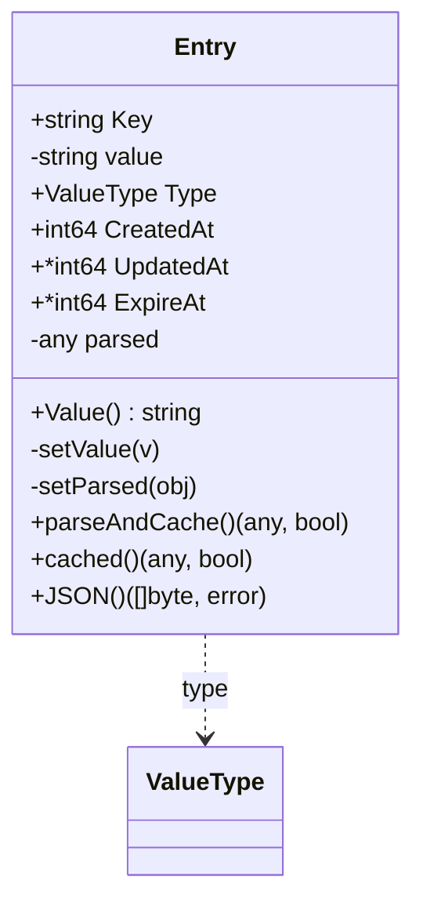
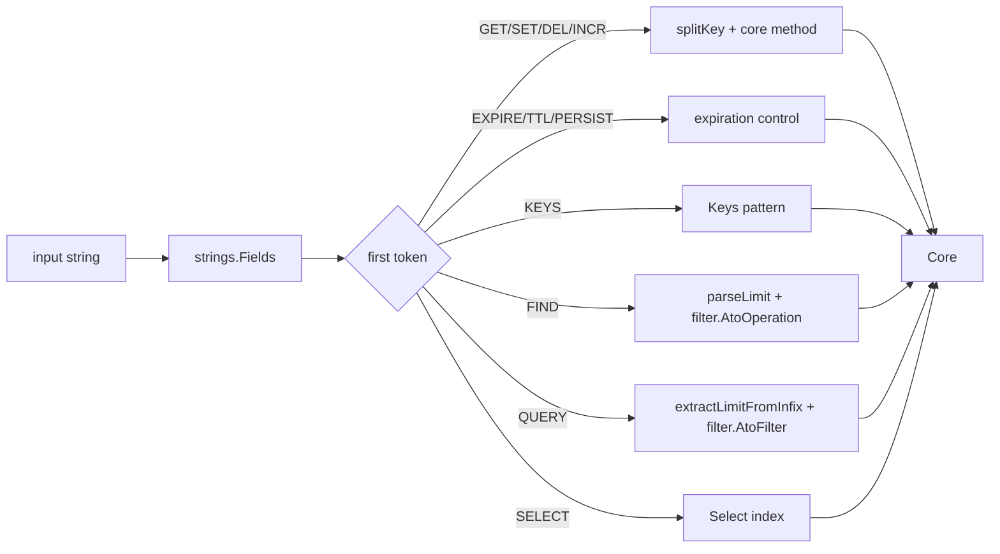
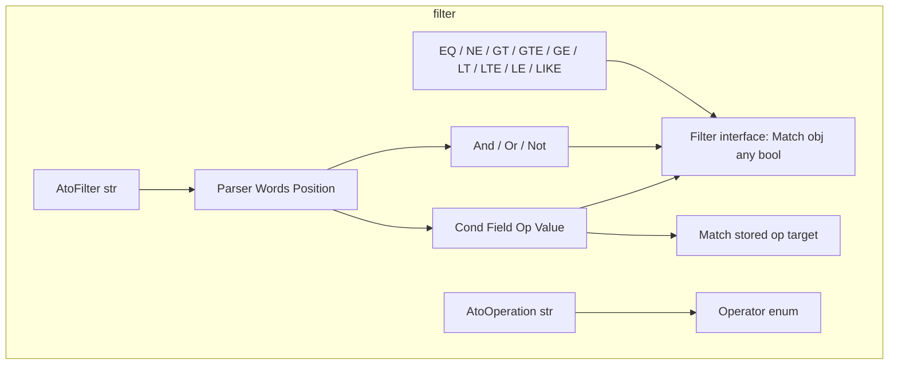
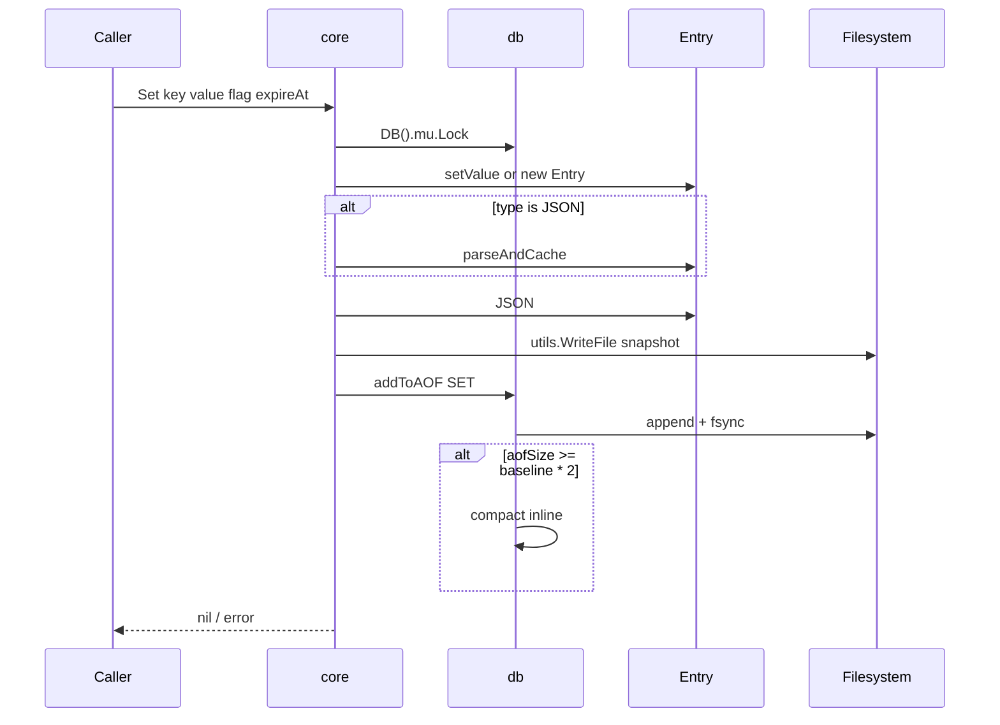
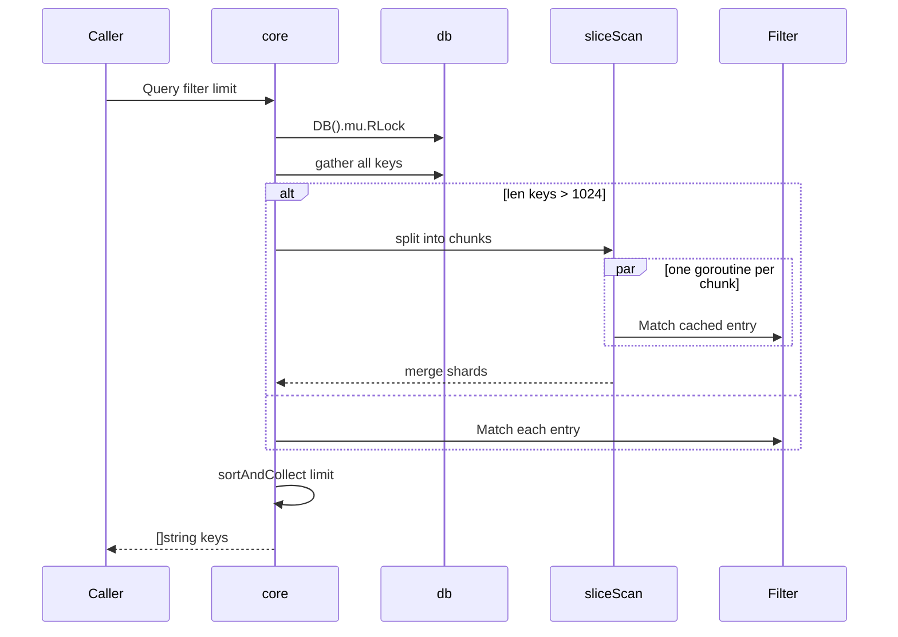
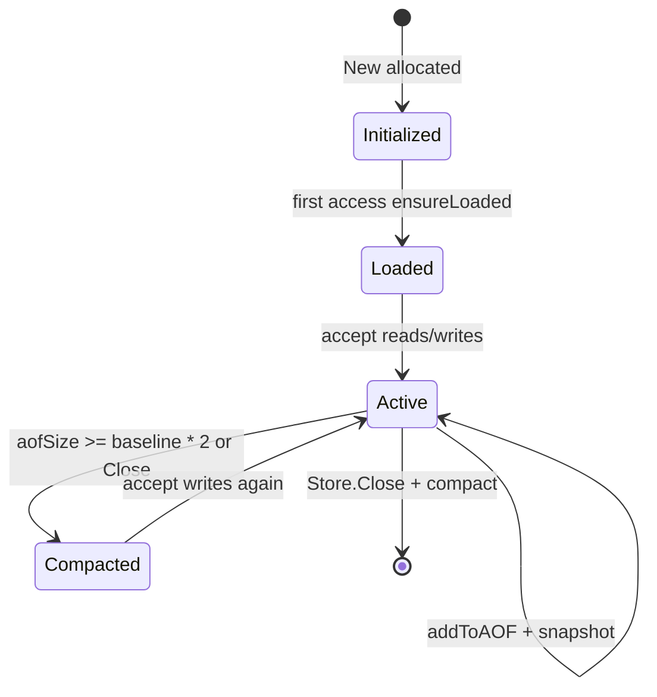

# ToriiDB - Architecture

> Back to [README](../README.md)

## Overview

Core object relationships:

- `Store` owns the `[16]*db` array and the `cleanTimer` context cancel.
- `core` is the struct embedded by both `Store` and `Session`, holding a pointer to `Store.allDBs` and the current db index.
- `Session` is spawned by `Store.Session()`, sharing the underlying db array while owning its own index.
- The `filter` package is independent from `store`, consumed only through the `Filter` interface in `Query`.

## Module: Store

Owns the database lifecycle, directory layout, and background expiration sweeper.

- `New(path ...string)`: validates the directory, allocates `[16]*db`, and starts the background goroutine that runs `cleanExpired` every minute.
- `Close()`: cancels the context so `cleanTimer` exits, then uses a `sync.WaitGroup` to compact every `loaded` db in parallel.
- `Session()`: clones `core` so upper-layer goroutines can switch databases without affecting the original Store.

## Module: db

Per-database memory state and persistence carriers.

- `ensureLoaded`: `sync.Once` guarantees AOF replay only runs once, so pre-access startup cost is zero.
- `init`: lazily creates the AOF file, opening `record.aof` only on the first write.
- `compact`: closes the current AOF, remarshals non-expired entries, and atomically replaces the file via `utils.WriteFile`.
- `cleanExpired`: scans `data`, drops entries whose `ExpireAt <= now`, and removes their JSON snapshot files.

## Module: Entry

Represents both in-memory state and the on-disk JSON snapshot format, while maintaining a parsed cache.

Lock discipline:

- `parseAndCache()` mutates `e.parsed`, so callers must hold the write lock or run single-threaded (`Set` / `SetField` / `IncrField` / `DelField` / AOF replay).
- `cached()` only reads `e.parsed` and is safe to call under an RLock (`Query` / `GetField`).
- Every write path must warm `parsed` before releasing the write lock so readers always see a populated cache.

## Module: Exec

The single routing point for REPL commands, parsing string input into `core` method calls.

- `splitKey` cuts on the first `.` into main key + sub-keys; without a `.`, the plain KV path runs.
- `parseSetArgs` walks the args backwards: a trailing integer is treated as TTL seconds, and a preceding `NX`/`XX` becomes the flag.
- `extractLimitFromInfix` and `parseLimit` strip `LIMIT <n>` from the tail of the expression.

## Module: filter

The shared predicate engine under `Query`, also shipping a string-expression parser.

- `Parser` is recursive-descent: `Or` → `And` → `Not` → `Primary`, with parentheses and base predicates handled inside `Primary`.
- `AtoFilter` first peels leading `(` and trailing `)` into standalone tokens, then hands the token list to `Parser.Or()` to build the AST.
- `Match` accepts both numeric and string values — numeric comparison first tries `utils.Vtof`, falling back to string comparison on failure.

## Data Flow: Set → Persistence

## Data Flow: Query → Chunked Parallelism

## State Machine: db lifecycle

***

©️ 2026 [邱敬幃 Pardn Chiu](https://linkedin.com/in/pardnchiu)
