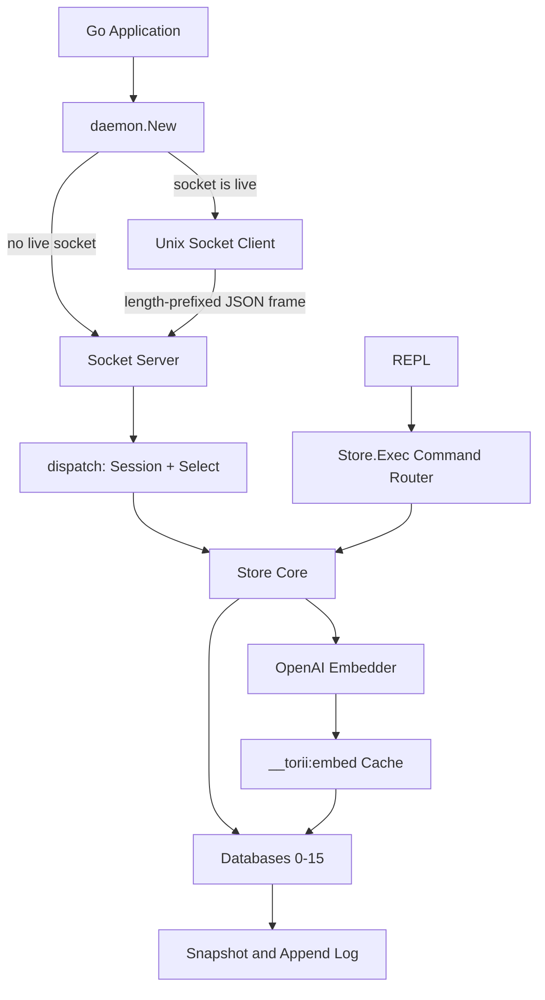
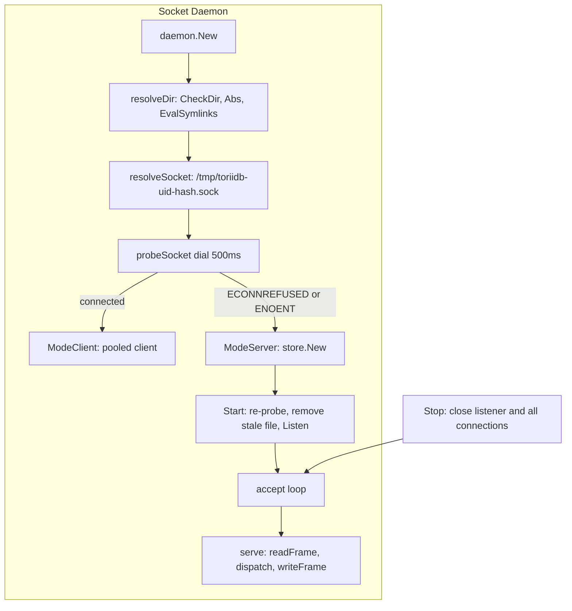
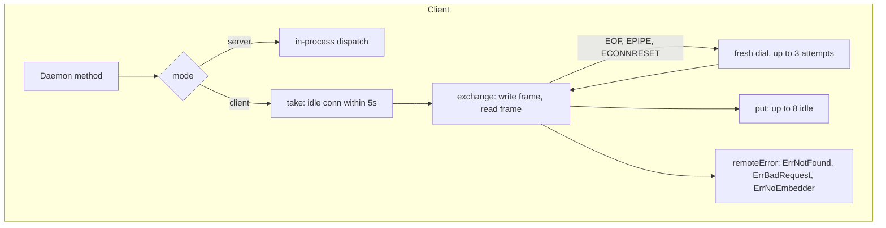
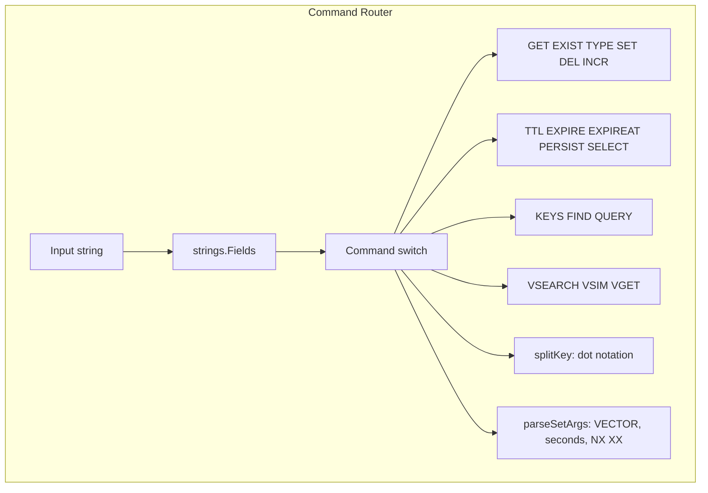
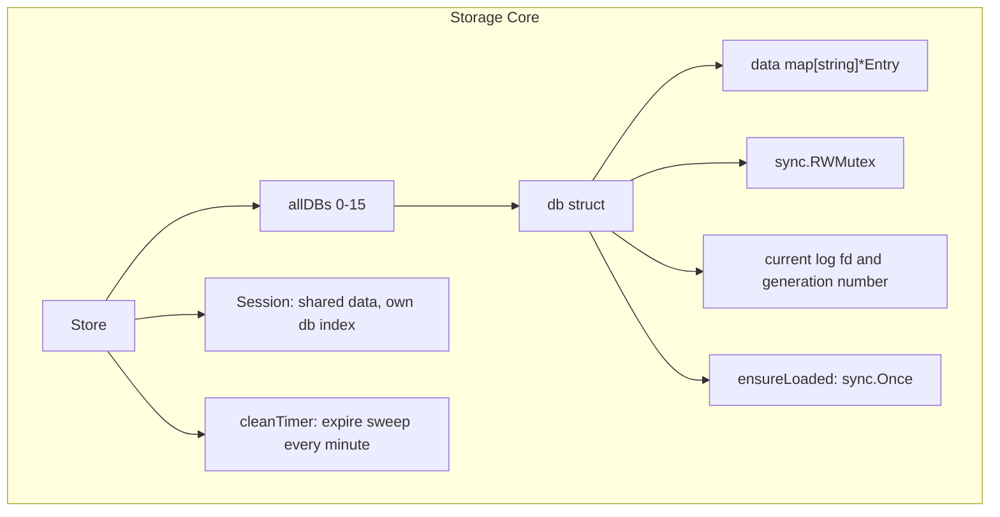
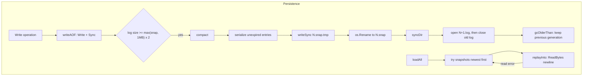
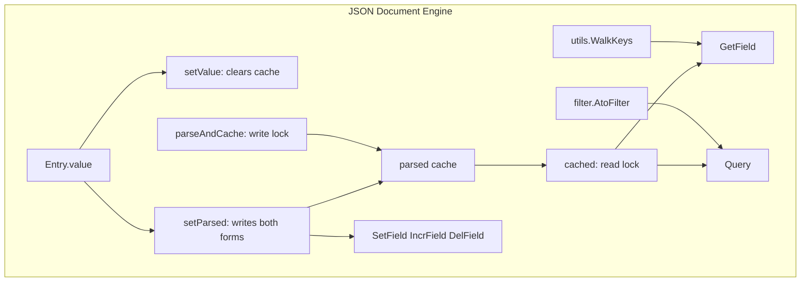
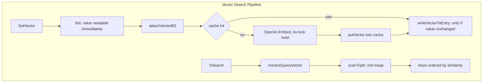
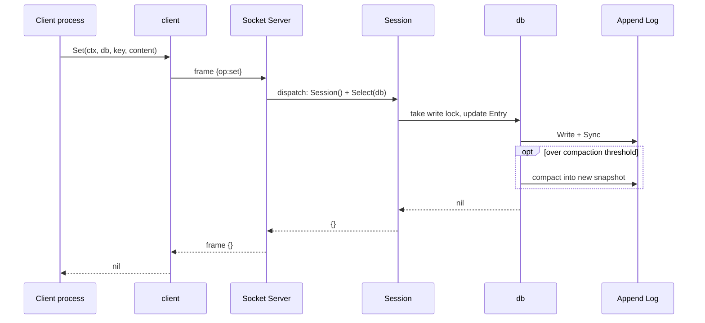
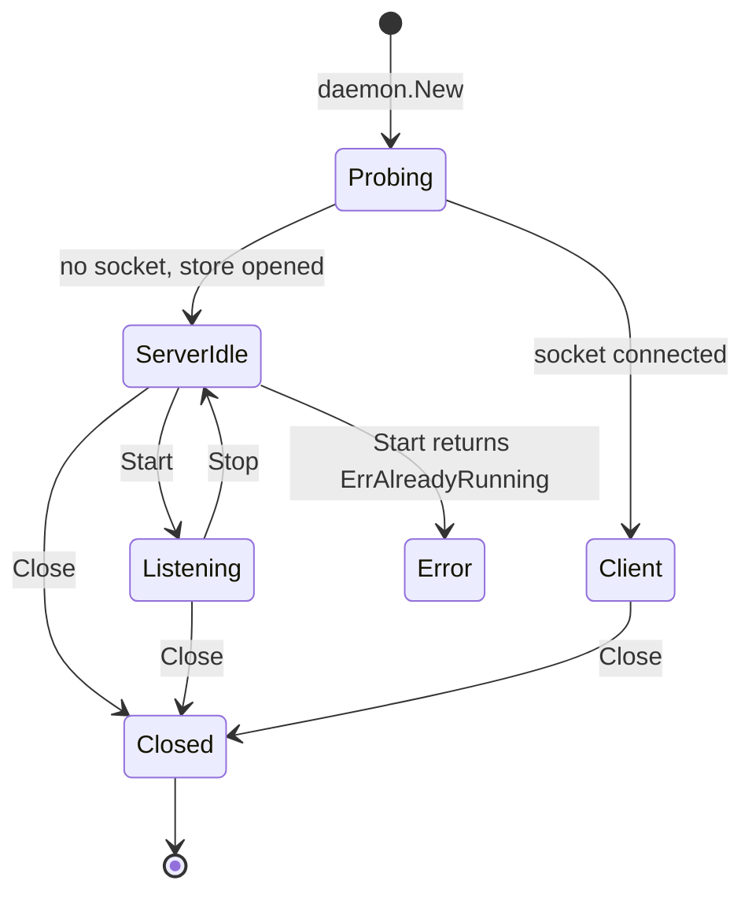

# toriidb - Architecture

> Back to [README](../README.md)

## Overview

```mermaid
graph TB
    APP[Go Application] --> NEW[daemon.New]
    NEW -->|socket is live| CLI[Unix Socket Client]
    NEW -->|no live socket| SRV[Socket Server]
    CLI -->|length-prefixed JSON frame| SRV
    SRV --> DISP[dispatch: Session + Select]
    REPL[REPL] --> EXEC[Store.Exec Command Router]
    DISP --> CORE[Store Core]
    EXEC --> CORE
    CORE --> DBS[Databases 0-15]
    DBS --> DISK[Snapshot and Append Log]
    CORE --> EMB[OpenAI Embedder]
    EMB --> CACHE[__torii:embed Cache]
    CACHE --> DBS
```

## Module: Socket Daemon

Derives one socket per data directory; the first caller becomes the server and every later caller a client.

```mermaid
graph TB
    subgraph Socket Daemon
        A[daemon.New] --> B[resolveDir: CheckDir, Abs, EvalSymlinks]
        B --> C["resolveSocket: /tmp/toriidb-uid-hash.sock"]
        C --> D[probeSocket dial 500ms]
        D -->|connected| E[ModeClient: pooled client]
        D -->|ECONNREFUSED or ENOENT| F[ModeServer: store.New]
        F --> G[Start: re-probe, remove stale file, Listen]
        G --> H[accept loop]
        H --> I[serve: readFrame, dispatch, writeFrame]
    end
    J[Stop: close listener and all connections] --> H
```

## Module: Wire Protocol and Client

Both directions use `[4-byte big-endian length][JSON]`; the client keeps a connection pool and retries dropped connections.

```mermaid
graph TB
    subgraph Client
        A[Daemon method] --> B{mode}
        B -->|server| C[in-process dispatch]
        B -->|client| D[take: idle conn within 5s]
        D --> E[exchange: write frame, read frame]
        E -->|EOF, EPIPE, ECONNRESET| F[fresh dial, up to 3 attempts]
        F --> E
        E --> G[put: up to 8 idle]
        E --> H[remoteError: ErrNotFound, ErrBadRequest, ErrNoEmbedder]
    end
```

## Module: Command Router

Parses text commands for the REPL and `Exec` callers.

```mermaid
graph TB
    subgraph Command Router
        A[Input string] --> B[strings.Fields]
        B --> C[Command switch]
        C --> D[GET EXIST TYPE SET DEL INCR]
        C --> E[TTL EXPIRE EXPIREAT PERSIST SELECT]
        C --> F[KEYS FIND QUERY]
        C --> G[VSEARCH VSIM VGET]
        C --> H[splitKey: dot notation]
        C --> I[parseSetArgs: VECTOR, seconds, NX XX]
    end
```

## Module: Storage Core

Each of the 16 databases has its own lock, map, log, and load-once guard.

```mermaid
graph TB
    subgraph Storage Core
        A[Store] --> B[allDBs 0-15]
        A --> S[Session: shared data, own db index]
        B --> C[db struct]
        C --> D["data map[string]*Entry"]
        C --> E[sync.RWMutex]
        C --> F[current log fd and generation number]
        C --> G[ensureLoaded: sync.Once]
        A --> T[cleanTimer: expire sweep every minute]
    end
```

## Module: Persistence

Writes are fsynced to an append log; past the threshold they are compacted into a new snapshot while the previous generation is kept.

```mermaid
graph TB
    subgraph Persistence
        A[Write operation] --> B[writeAOF: Write + Sync]
        B --> C{"log size >= max(snap, 1MB) x 2"}
        C -->|yes| D[compact]
        D --> E[serialize unexpired entries]
        E --> F[writeSync N.snap.tmp]
        F --> G[os.Rename to N.snap]
        G --> H[syncDir]
        H --> I[open N+1.log, then close old log]
        I --> J[gcOlderThan: keep previous generation]
        K[loadAll] --> L[try snapshots newest first]
        L --> M[replayInto: ReadBytes newline]
        M -->|read error| L
    end
```

## Module: JSON Document Engine

The raw string and parsed cache change together only through `setValue`/`setParsed`.

```mermaid
graph TB
    subgraph JSON Document Engine
        A[Entry.value] --> B[setValue: clears cache]
        A --> C[setParsed: writes both forms]
        C --> D[parsed cache]
        P[parseAndCache: write lock] --> D
        D --> Q[cached: read lock]
        Q --> E[GetField]
        Q --> F[Query]
        C --> G[SetField IncrField DelField]
        H[utils.WalkKeys] --> E
        I[filter.AtoFilter] --> F
    end
```

## Module: Vector Search Pipeline

Embeddings attach in the background; queries check the cache first, then take the top K by cosine similarity.

```mermaid
graph TB
    subgraph Vector Search Pipeline
        A[SetVector] --> B[Set: value readable immediately]
        B --> C[attachVectorBG]
        C --> D{cache hit}
        D -->|no| E[OpenAI Embed, no lock held]
        E --> F[putVector into cache]
        D -->|yes| G[writeVectorToEntry: only if value unchanged]
        F --> G
        H[VSearch] --> I[resolveQueryVector]
        I --> J[scanTopK: min-heap]
        J --> K[Keys ordered by similarity]
    end
```

## Data Flow

A client writes one value over the socket:

```mermaid
sequenceDiagram
    participant App as Client process
    participant Cli as client
    participant Srv as Socket Server
    participant Sess as Session
    participant DB as db
    participant Log as Append Log
    App->>Cli: Set(ctx, db, key, content)
    Cli->>Srv: frame {op:set}
    Srv->>Sess: dispatch: Session() + Select(db)
    Sess->>DB: take write lock, update Entry
    DB->>Log: Write + Sync
    opt over compaction threshold
        DB->>Log: compact into new snapshot
    end
    DB-->>Sess: nil
    Sess-->>Srv: {}
    Srv-->>Cli: frame {}
    Cli-->>App: nil
```

## State Machine

Daemon lifecycle:

```mermaid
stateDiagram-v2
    [*] --> Probing: daemon.New
    Probing --> Client: socket connected
    Probing --> ServerIdle: no socket, store opened
    ServerIdle --> Listening: Start
    ServerIdle --> Error: Start returns ErrAlreadyRunning
    Listening --> ServerIdle: Stop
    ServerIdle --> Closed: Close
    Listening --> Closed: Close
    Client --> Closed: Close
    Closed --> [*]
```

***

©️ 2026 [邱敬幃 Pardn Chiu](https://www.linkedin.com/in/pardnchiu)
