# ToriiDB - 架構

> 返回 [README](./README.zh.md)

## 概覽

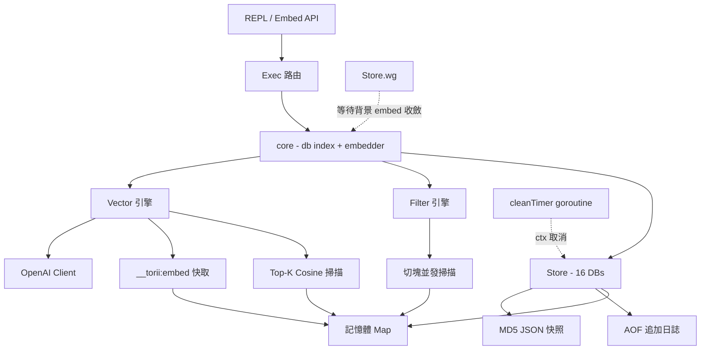

核心物件關係：

- `Store` 擁有 `[16]*db` 陣列、`cleanTimer` 的 context cancel，以及追蹤背景向量補寫的 `sync.WaitGroup`。
- `core` 是 `Store` 與 `Session` 的嵌入結構，持有指向 `Store.allDBs` 的指標、目前 db index，以及共用的 `*openai.Client`（未設 `OPENAI_API_KEY` 時為 nil）。
- `Session` 由 `Store.Session()` 衍生，共享底層 db 陣列、embedder 與 WaitGroup，但擁有獨立 index。
- `filter` 套件獨立於 store，僅透過 `Filter` 介面被 `Query` 呼叫。
- 向量路徑為 opt-in：`SetVector` / `VSearch` 在 embedder 為 nil 時會明確回錯，核心 KV 路徑執行期不受影響。

## Module: Store

負責資料庫生命週期、目錄配置與背景過期清理。

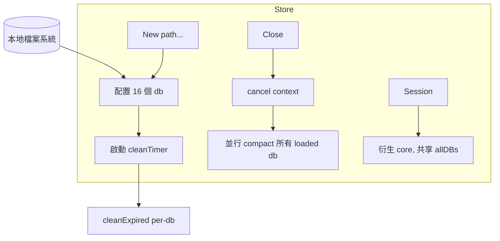

- `New(path ...string)`：驗證目錄後配置 `[16]*db`，啟動每分鐘執行 `cleanExpired` 的背景 goroutine。
- `Close()`：取消 context 讓 `cleanTimer` 結束，並以 `sync.WaitGroup` 並行壓縮每個 `loaded` 的 db。
- `Session()`：複製 `core`，讓上層 goroutine 切換 db 不影響原 Store。

## Module: db

單一資料庫的記憶體狀態與持久化載體。

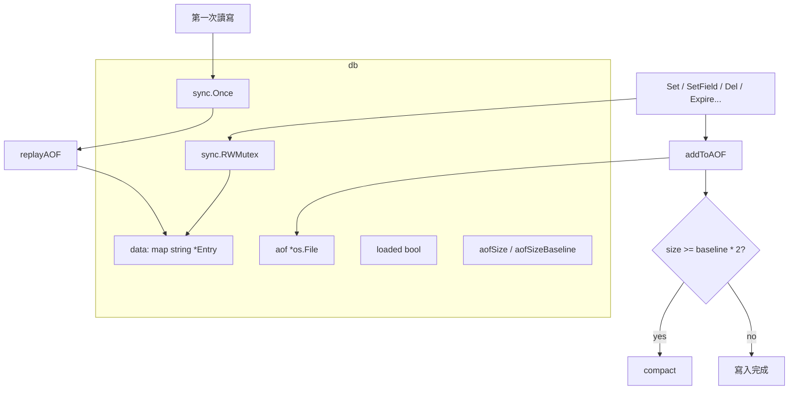

- `ensureLoaded`：`sync.Once` 保證 AOF 只 replay 一次，首次存取前啟動成本為零。
- `init`：延遲建立 AOF 檔，僅在第一次寫入時打開 `record.aof`。
- `compact`：關閉目前 AOF、將非過期 entry 重新 marshal 後透過 `utils.WriteFile` atomically 替換。
- `cleanExpired`：掃描 `data`，刪除 `ExpireAt <= now` 的記錄並一併移除對應 JSON 快照檔。

## Module: Entry

同時代表記憶體狀態與 JSON 快照格式，並維護 parsed 快取。

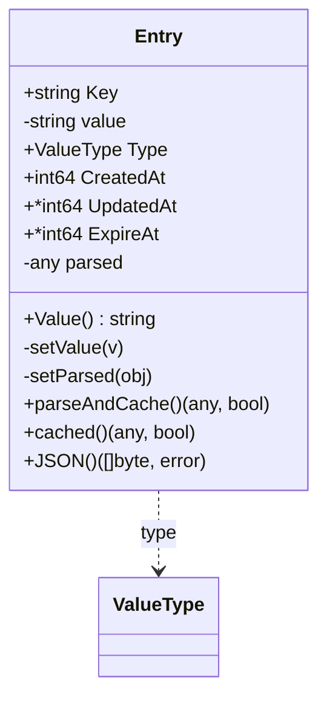

鎖紀律：

- `parseAndCache()` 會寫入 `e.parsed`，呼叫者必須持有寫鎖或處於單執行緒路徑（`Set` / `SetField` / `IncrField` / `DelField` / AOF replay）。
- `cached()` 僅讀取 `e.parsed`，安全於 RLock 下呼叫（`Query` / `GetField`）。
- 每個寫入路徑在釋放寫鎖之前必須先 warm `parsed`，確保讀取端永遠能命中快取。

## Module: Exec

REPL 命令的單一路由點，將字串輸入解析成 `core` 方法呼叫。

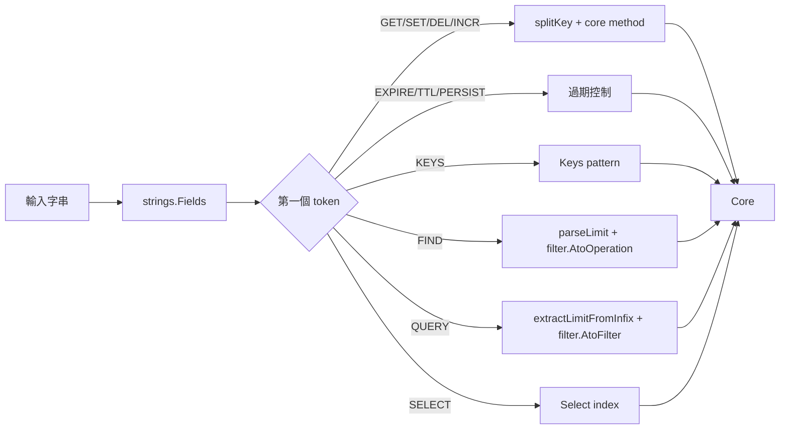

- `splitKey` 以首個 `.` 切分成主 key 與子 key 列表，無 `.` 時走一般 KV 路徑。
- `parseSetArgs` 從尾端倒著解析：最後一個整數視為 TTL 秒數、倒數第二個 `NX`/`XX` 視為 flag。
- `extractLimitFromInfix` 與 `parseLimit` 負責將 `LIMIT <n>` 從表達式尾端剝離。

## Module: filter

`Query` 底層共用的條件匹配引擎，同時提供字串表達式解析。

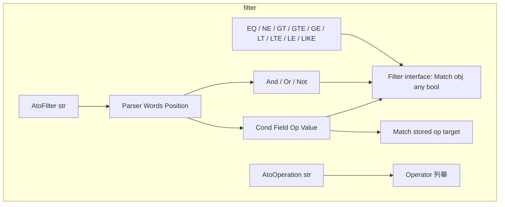

- `Parser` 以遞迴下降實作：`Or` → `And` → `Not` → `Primary`，於 `Primary` 中處理括號與基本條件。
- `AtoFilter` 先將 `(` / `)` 從 token 中剝離成獨立詞，再交給 `Parser.Or()` 建構 AST。
- `Match` 同時接受數值與字串，數值比較先走 `utils.Vtof`，失敗後退回字串比較。

## Module: Vector

向量直接掛在 `Entry` 上內嵌保存，唯一的旁路資料是 `__torii:embed:*` 前綴下的 embedding 快取。

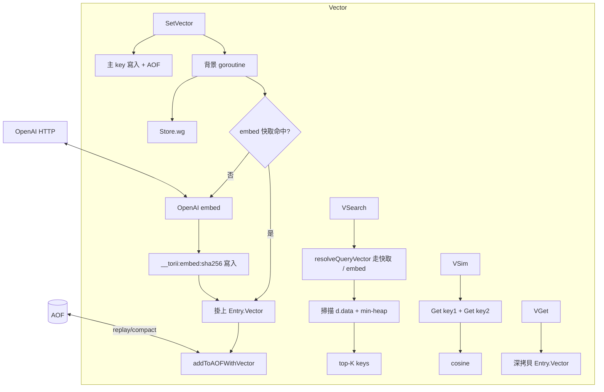

- `Entry.Vector []float32`：每個 key 內嵌的 embedding，缺席時為 `nil`。
- `vector.go`：base64 little-endian float32 編解碼（`encodeVector` / `decodeVector`）、`cosine`、`isInternal` — 凡是以 `__torii:` 保留前綴開頭的 key 都會被掃描類指令跳過。
- `vcache.go`：`getVector` / `putVector` 將 embedding 以 ToriiDB entry 形式快取於 `__torii:embed:<sha256(model|dim|text)>`。Payload 為 JSON `{"v":"<base64>","d":<dim>,"m":"<model>"}`。`d != currentDim` 視為 MISS；無 TTL — embedding 在 (model, dim, text) 下是決定性的。
- `aof.go`：`AOFRecord.Vector *string` 寫入 base64 向量，僅在 `len(vec) > 0` 時輸出，確保與既有紀錄向後相容。`replayAOF` 解碼還原 `Entry.Vector`，`compact` 重新寫回。
- `SetVector` 鎖序：主 key 以寫鎖寫入 → AOF → 釋鎖；背景 goroutine 以 RLock 讀 `__torii:embed:*`，打 OpenAI 時**完全不持鎖**，之後再取兩次寫鎖（一次寫入快取，一次掛 Entry.Vector + 追加 AOF）。
- 一般 `Set()` 在覆寫時會清空 `Entry.Vector` — 未帶 `VECTOR` 重新 SET 表示底層文字已變，舊 embedding 需一併作廢。
- `VSearch` 全程持 db RLock；`scanTopK` 以大小為 k 的 min-heap 維護結果，最壞情況 O(n log k)。
- `Close()` 會先 block 在 `Store.wg` 上等待背景 embed 排空，確保不會與 AOF compaction 競態。

## Data Flow: Set → 持久化

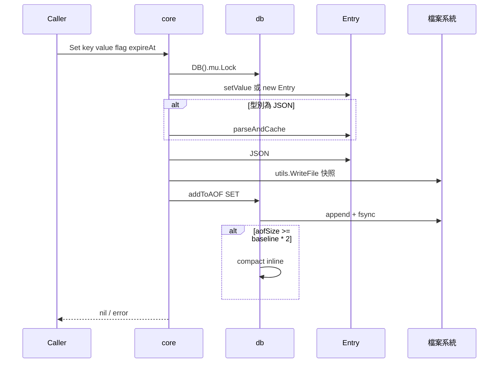

## Data Flow: Query → 切塊並發

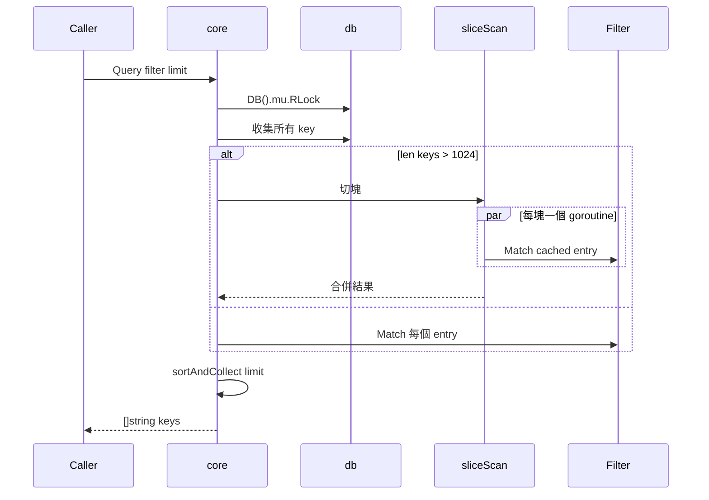

## Data Flow: SetVector → 非同步掛載

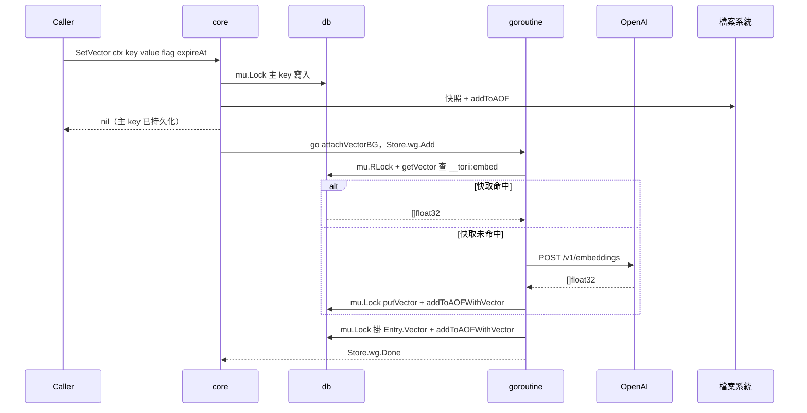

## Data Flow: VSearch → Top-K Cosine

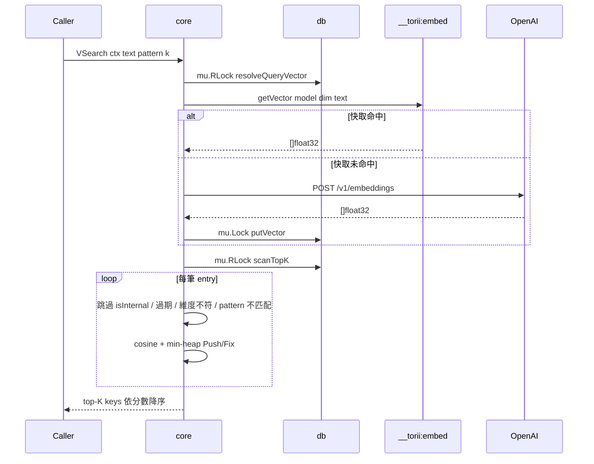

## State Machine: db 生命週期

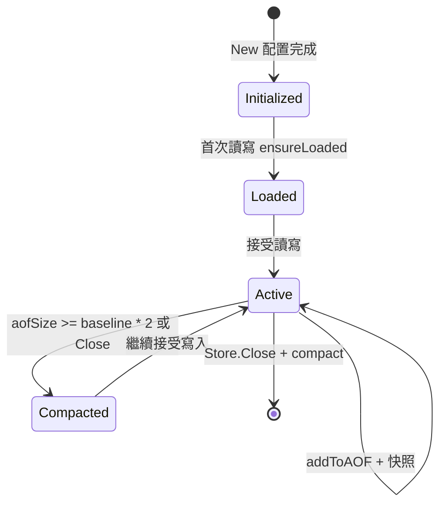

***

©️ 2026 [邱敬幃 Pardn Chiu](https://linkedin.com/in/pardnchiu)
