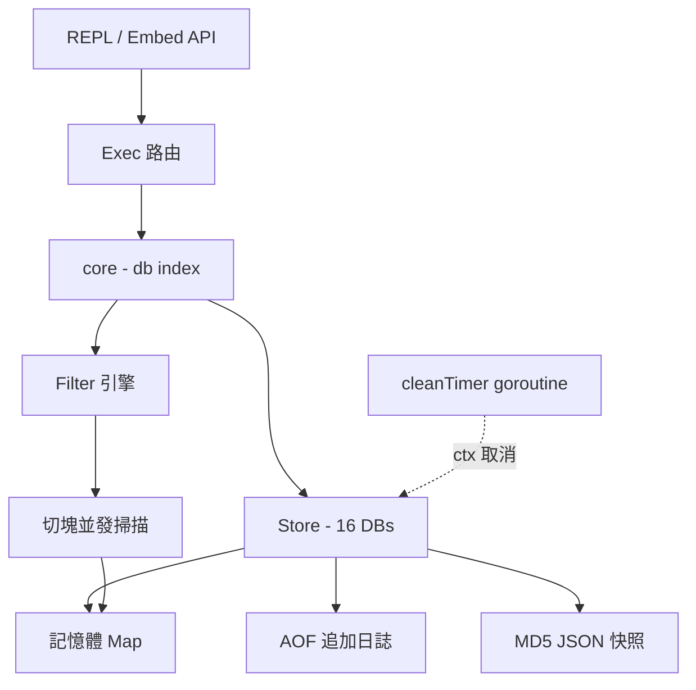
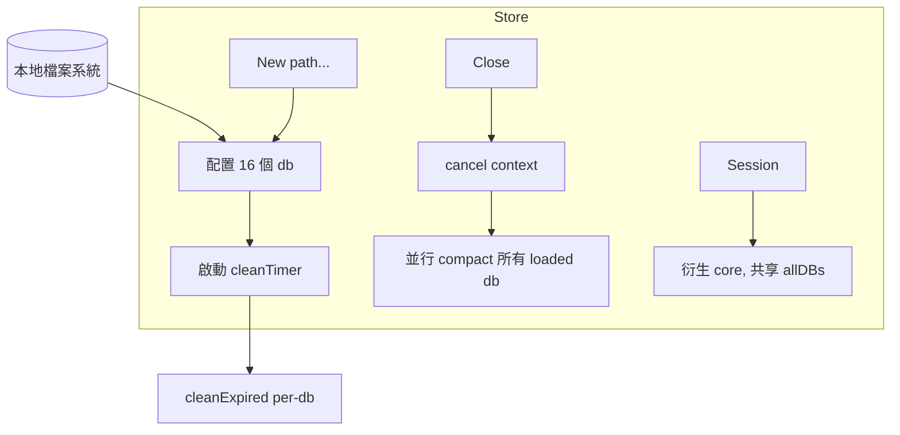
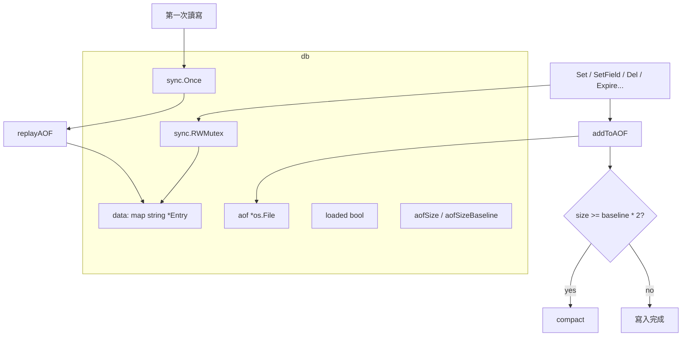
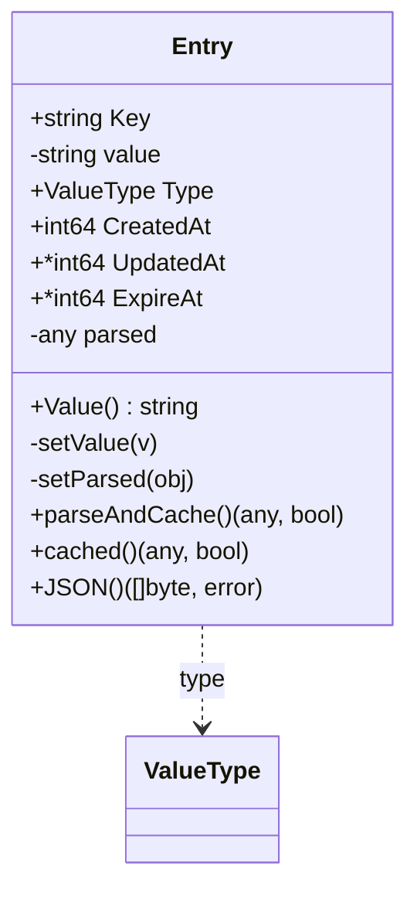
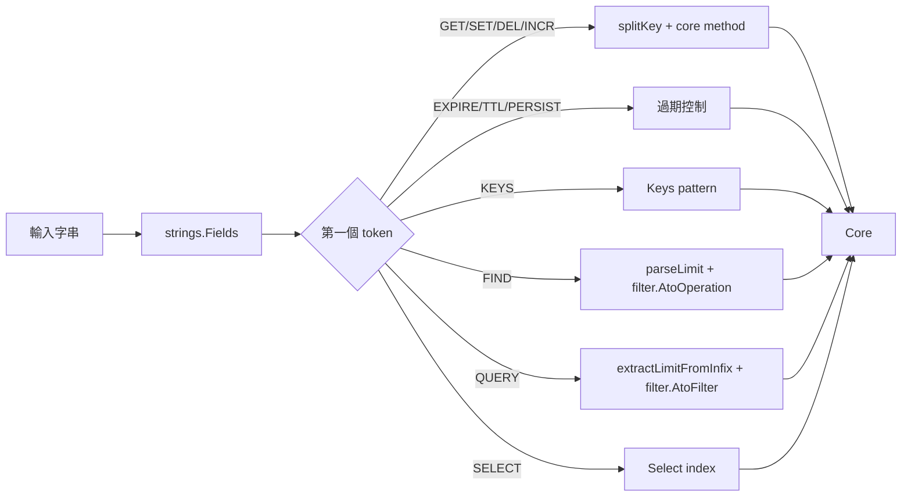
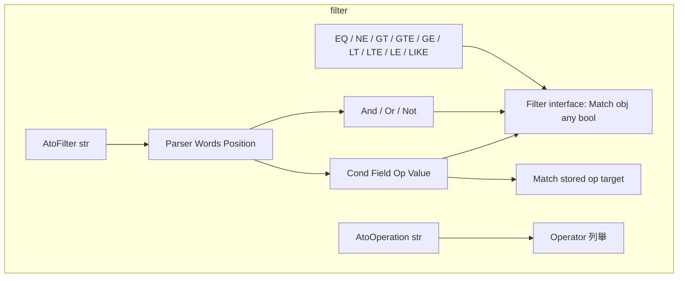
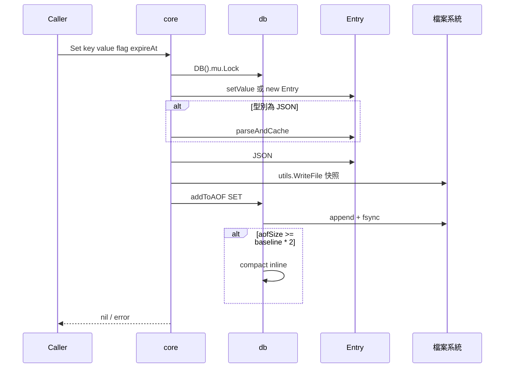
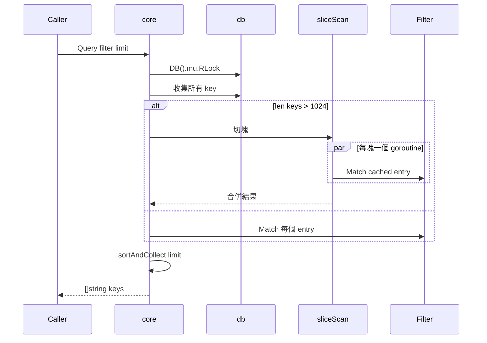
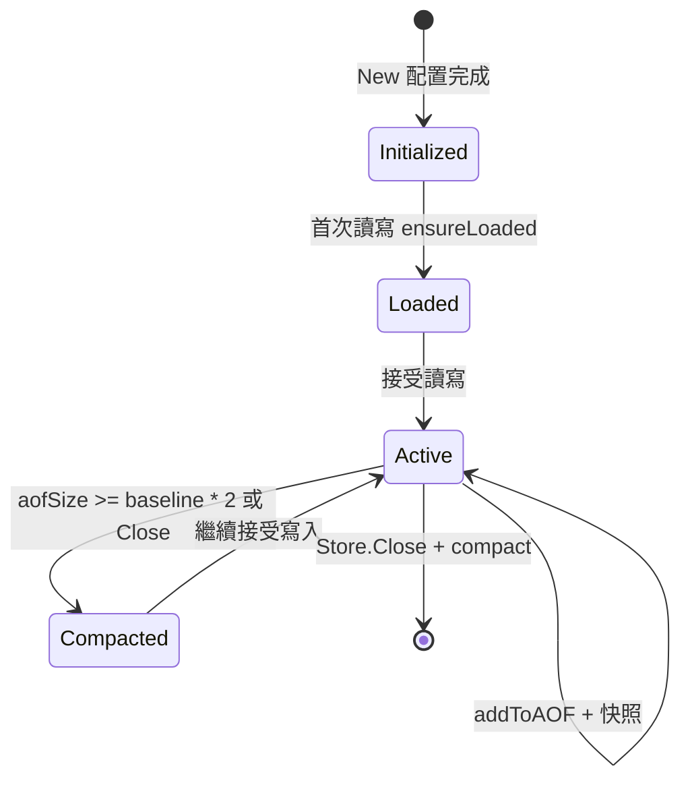

# ToriiDB - 架構

> 返回 [README](./README.zh.md)

## 概覽

核心物件關係：

- `Store` 擁有 `[16]*db` 陣列與 `cleanTimer` 的 context cancel。
- `core` 是 `Store` 與 `Session` 的嵌入結構，持有指向 `Store.allDBs` 的指標與目前 db index。
- `Session` 由 `Store.Session()` 衍生，共享底層 db 陣列但擁有獨立 index。
- `filter` 套件獨立於 store，僅透過 `Filter` 介面被 `Query` 呼叫。

## Module: Store

負責資料庫生命週期、目錄配置與背景過期清理。

- `New(path ...string)`：驗證目錄後配置 `[16]*db`，啟動每分鐘執行 `cleanExpired` 的背景 goroutine。
- `Close()`：取消 context 讓 `cleanTimer` 結束，並以 `sync.WaitGroup` 並行壓縮每個 `loaded` 的 db。
- `Session()`：複製 `core`，讓上層 goroutine 切換 db 不影響原 Store。

## Module: db

單一資料庫的記憶體狀態與持久化載體。

- `ensureLoaded`：`sync.Once` 保證 AOF 只 replay 一次，首次存取前啟動成本為零。
- `init`：延遲建立 AOF 檔，僅在第一次寫入時打開 `record.aof`。
- `compact`：關閉目前 AOF、將非過期 entry 重新 marshal 後透過 `utils.WriteFile` atomically 替換。
- `cleanExpired`：掃描 `data`，刪除 `ExpireAt <= now` 的記錄並一併移除對應 JSON 快照檔。

## Module: Entry

同時代表記憶體狀態與 JSON 快照格式，並維護 parsed 快取。

鎖紀律：

- `parseAndCache()` 會寫入 `e.parsed`，呼叫者必須持有寫鎖或處於單執行緒路徑（`Set` / `SetField` / `IncrField` / `DelField` / AOF replay）。
- `cached()` 僅讀取 `e.parsed`，安全於 RLock 下呼叫（`Query` / `GetField`）。
- 每個寫入路徑在釋放寫鎖之前必須先 warm `parsed`，確保讀取端永遠能命中快取。

## Module: Exec

REPL 命令的單一路由點，將字串輸入解析成 `core` 方法呼叫。

- `splitKey` 以首個 `.` 切分成主 key 與子 key 列表，無 `.` 時走一般 KV 路徑。
- `parseSetArgs` 從尾端倒著解析：最後一個整數視為 TTL 秒數、倒數第二個 `NX`/`XX` 視為 flag。
- `extractLimitFromInfix` 與 `parseLimit` 負責將 `LIMIT <n>` 從表達式尾端剝離。

## Module: filter

`Query` 底層共用的條件匹配引擎，同時提供字串表達式解析。

- `Parser` 以遞迴下降實作：`Or` → `And` → `Not` → `Primary`，於 `Primary` 中處理括號與基本條件。
- `AtoFilter` 先將 `(` / `)` 從 token 中剝離成獨立詞，再交給 `Parser.Or()` 建構 AST。
- `Match` 同時接受數值與字串，數值比較先走 `utils.Vtof`，失敗後退回字串比較。

## Data Flow: Set → 持久化

## Data Flow: Query → 切塊並發

## State Machine: db 生命週期

***

©️ 2026 [邱敬幃 Pardn Chiu](https://linkedin.com/in/pardnchiu)
