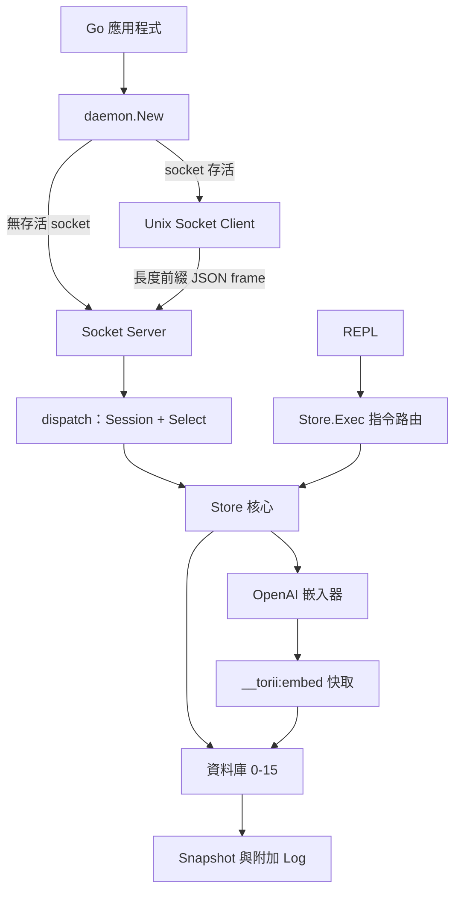
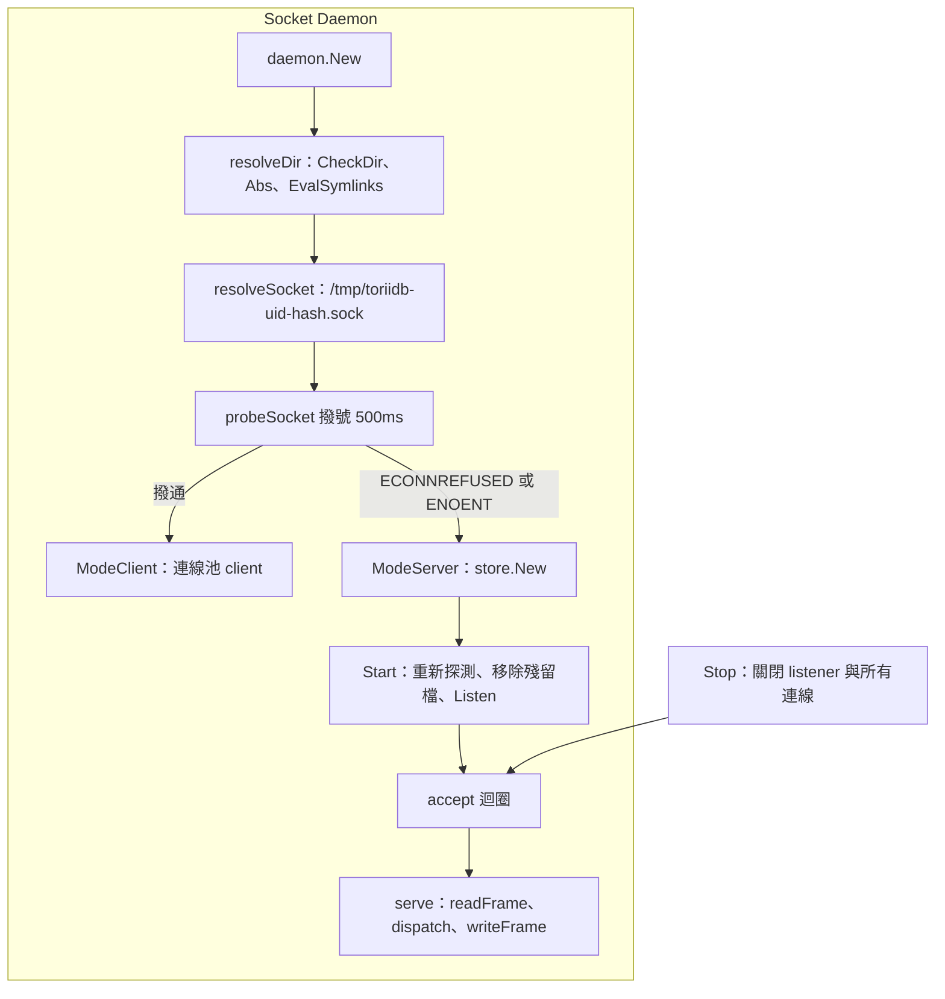
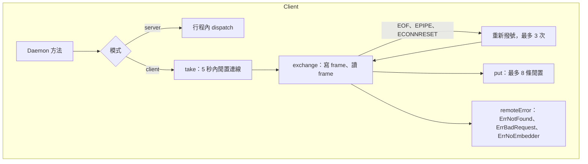
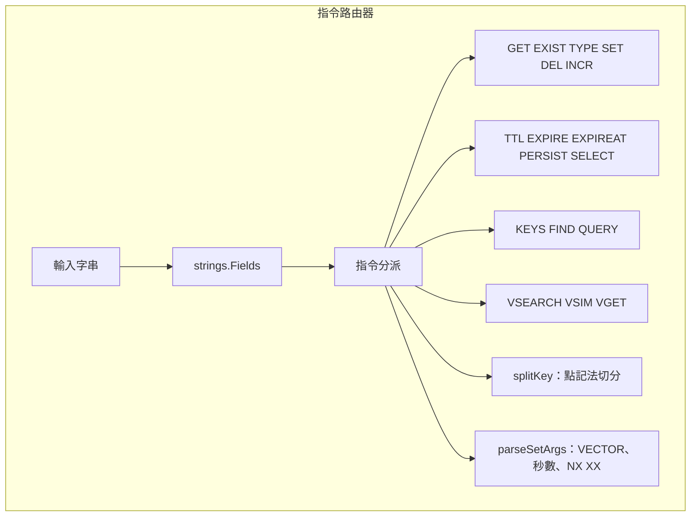
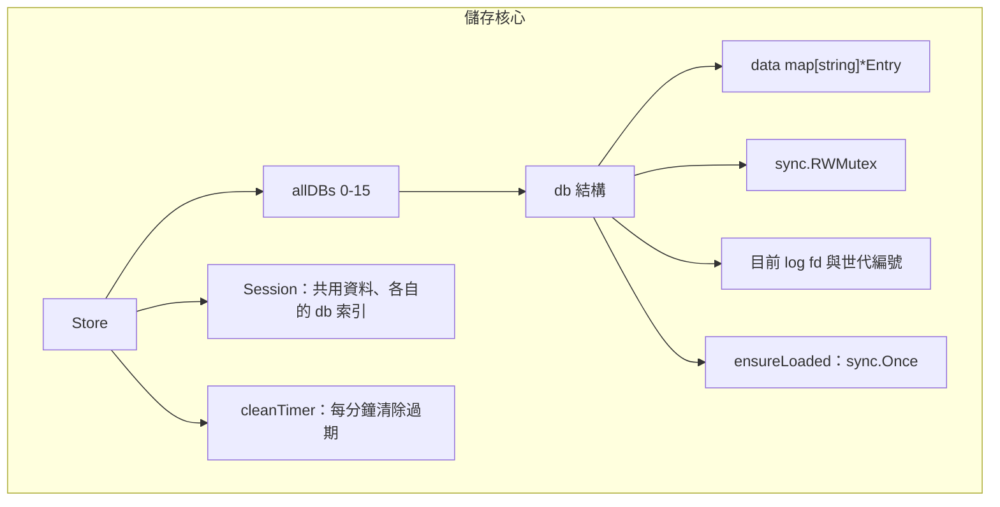
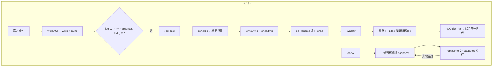
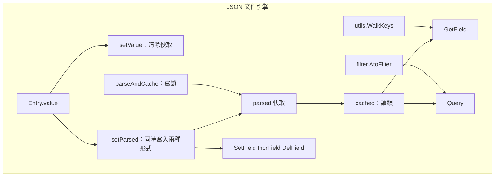
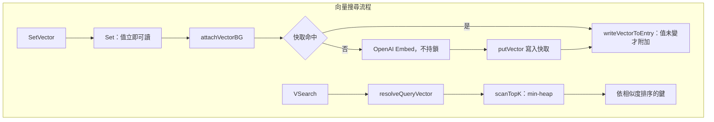
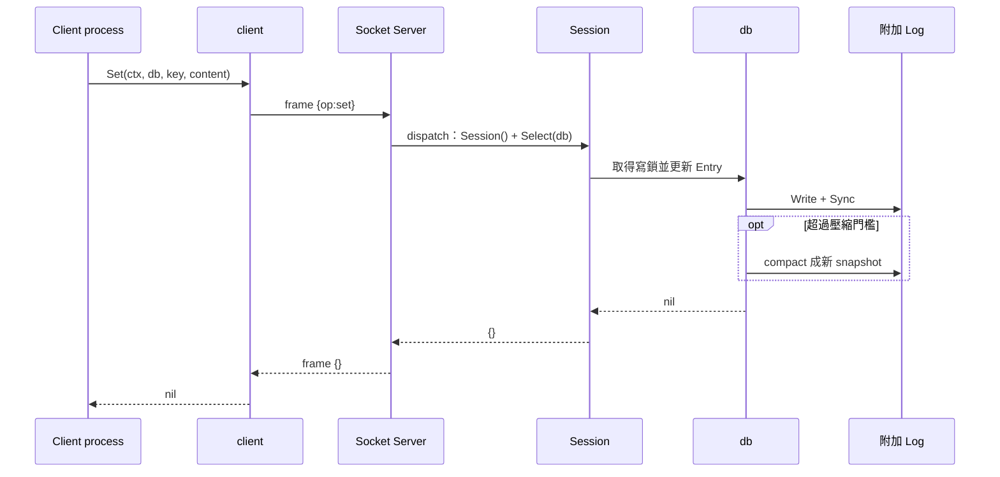
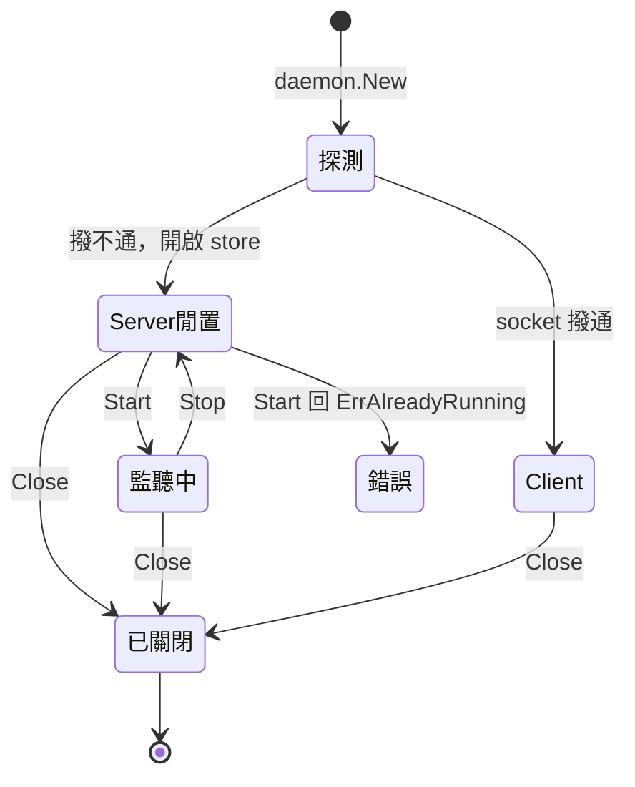

# toriidb - 架構

> 返回 [README](./README.zh.md)

## 概覽

```mermaid
graph TB
    APP[Go 應用程式] --> NEW[daemon.New]
    NEW -->|socket 存活| CLI[Unix Socket Client]
    NEW -->|無存活 socket| SRV[Socket Server]
    CLI -->|長度前綴 JSON frame| SRV
    SRV --> DISP[dispatch：Session + Select]
    REPL[REPL] --> EXEC[Store.Exec 指令路由]
    DISP --> CORE[Store 核心]
    EXEC --> CORE
    CORE --> DBS[資料庫 0-15]
    DBS --> DISK[Snapshot 與附加 Log]
    CORE --> EMB[OpenAI 嵌入器]
    EMB --> CACHE[__torii:embed 快取]
    CACHE --> DBS
```

## Module: Socket Daemon

依資料目錄推導唯一 socket，第一個呼叫端成為 server，其後皆為 client。

```mermaid
graph TB
    subgraph Socket Daemon
        A[daemon.New] --> B[resolveDir：CheckDir、Abs、EvalSymlinks]
        B --> C["resolveSocket：/tmp/toriidb-uid-hash.sock"]
        C --> D[probeSocket 撥號 500ms]
        D -->|撥通| E[ModeClient：連線池 client]
        D -->|ECONNREFUSED 或 ENOENT| F[ModeServer：store.New]
        F --> G[Start：重新探測、移除殘留檔、Listen]
        G --> H[accept 迴圈]
        H --> I[serve：readFrame、dispatch、writeFrame]
    end
    J[Stop：關閉 listener 與所有連線] --> H
```

## Module: Wire Protocol 與 Client

兩個方向皆為 `[4-byte big-endian 長度][JSON]`，client 端維護連線池並對斷線重試。

```mermaid
graph TB
    subgraph Client
        A[Daemon 方法] --> B{模式}
        B -->|server| C[行程內 dispatch]
        B -->|client| D[take：5 秒內閒置連線]
        D --> E[exchange：寫 frame、讀 frame]
        E -->|EOF、EPIPE、ECONNRESET| F[重新撥號，最多 3 次]
        F --> E
        E --> G[put：最多 8 條閒置]
        E --> H[remoteError：ErrNotFound、ErrBadRequest、ErrNoEmbedder]
    end
```

## Module: Command Router

REPL 與 `Exec` 呼叫端的文字指令解析。

```mermaid
graph TB
    subgraph 指令路由器
        A[輸入字串] --> B[strings.Fields]
        B --> C[指令分派]
        C --> D[GET EXIST TYPE SET DEL INCR]
        C --> E[TTL EXPIRE EXPIREAT PERSIST SELECT]
        C --> F[KEYS FIND QUERY]
        C --> G[VSEARCH VSIM VGET]
        C --> H[splitKey：點記法切分]
        C --> I[parseSetArgs：VECTOR、秒數、NX XX]
    end
```

## Module: Storage Core

16 個資料庫各有獨立的鎖、map、log 與只載入一次的保護。

```mermaid
graph TB
    subgraph 儲存核心
        A[Store] --> B[allDBs 0-15]
        A --> S[Session：共用資料、各自的 db 索引]
        B --> C[db 結構]
        C --> D["data map[string]*Entry"]
        C --> E[sync.RWMutex]
        C --> F[目前 log fd 與世代編號]
        C --> G[ensureLoaded：sync.Once]
        A --> T[cleanTimer：每分鐘清除過期]
    end
```

## Module: Persistence

寫入 fsync 到附加 log，達門檻後壓縮成新 snapshot，並保留前一世代。

```mermaid
graph TB
    subgraph 持久化
        A[寫入操作] --> B[writeAOF：Write + Sync]
        B --> C{"log 大小 >= max(snap, 1MB) x 2"}
        C -->|是| D[compact]
        D --> E[serialize 未過期項目]
        E --> F[writeSync N.snap.tmp]
        F --> G[os.Rename 為 N.snap]
        G --> H[syncDir]
        H --> I[開啟 N+1.log 後關閉舊 log]
        I --> J[gcOlderThan：保留前一世代]
        K[loadAll] --> L[由新到舊嘗試 snapshot]
        L --> M[replayInto：ReadBytes 換行]
        M -->|讀取錯誤| L
    end
```

## Module: JSON Document Engine

原始字串與解析快取只透過 `setValue`／`setParsed` 同步修改。

```mermaid
graph TB
    subgraph JSON 文件引擎
        A[Entry.value] --> B[setValue：清除快取]
        A --> C[setParsed：同時寫入兩種形式]
        C --> D[parsed 快取]
        P[parseAndCache：寫鎖] --> D
        D --> Q[cached：讀鎖]
        Q --> E[GetField]
        Q --> F[Query]
        C --> G[SetField IncrField DelField]
        H[utils.WalkKeys] --> E
        I[filter.AtoFilter] --> F
    end
```

## Module: Vector Search Pipeline

背景附加 embedding，查詢時先查快取再以餘弦相似度取 Top-K。

```mermaid
graph TB
    subgraph 向量搜尋流程
        A[SetVector] --> B[Set：值立即可讀]
        B --> C[attachVectorBG]
        C --> D{快取命中}
        D -->|否| E[OpenAI Embed，不持鎖]
        E --> F[putVector 寫入快取]
        D -->|是| G[writeVectorToEntry：值未變才附加]
        F --> G
        H[VSearch] --> I[resolveQueryVector]
        I --> J[scanTopK：min-heap]
        J --> K[依相似度排序的鍵]
    end
```

## 資料流

Client 透過 socket 寫入一筆資料：

```mermaid
sequenceDiagram
    participant App as Client process
    participant Cli as client
    participant Srv as Socket Server
    participant Sess as Session
    participant DB as db
    participant Log as 附加 Log
    App->>Cli: Set(ctx, db, key, content)
    Cli->>Srv: frame {op:set}
    Srv->>Sess: dispatch：Session() + Select(db)
    Sess->>DB: 取得寫鎖並更新 Entry
    DB->>Log: Write + Sync
    opt 超過壓縮門檻
        DB->>Log: compact 成新 snapshot
    end
    DB-->>Sess: nil
    Sess-->>Srv: {}
    Srv-->>Cli: frame {}
    Cli-->>App: nil
```

## 狀態機

Daemon 生命週期：

```mermaid
stateDiagram-v2
    [*] --> 探測: daemon.New
    探測 --> Client: socket 撥通
    探測 --> Server閒置: 撥不通，開啟 store
    Server閒置 --> 監聽中: Start
    Server閒置 --> 錯誤: Start 回 ErrAlreadyRunning
    監聽中 --> Server閒置: Stop
    Server閒置 --> 已關閉: Close
    監聽中 --> 已關閉: Close
    Client --> 已關閉: Close
    已關閉 --> [*]
```

***

©️ 2026 [邱敬幃 Pardn Chiu](https://www.linkedin.com/in/pardnchiu)
